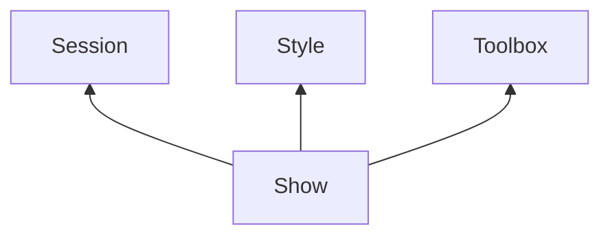

#Shows

*Shows* sind die Kernelemente von UNIQVUE und werden im *Showroom* über eine Playout Instanz ausgespielt. Der *Show* ist eine *Session* und die darin enthaltene *Agenda*, die Struktur Ihrer Präsentation zugewiesen. Über das Zuweisen eines *Styles* wird das gesamte Erscheinungsbild einer Show definiert. Durch Zuweisen einer Toolbox werden alle Funktionen Ihres Showroom-Systems festgelegt, die während Ihrer Show verfügbar sein sollen.
<!--

-->

***
##Show List

 
Das *Show List* Fenster unterteilt sich in 5 Bereiche (farbig markiert). 

&#9711 **Allgemeine [Bedienelemente](005_bedienelemente.md)**

&#9711 **User Folder:**

Übersicht der öffentlichen und benutzerspezifischen Verzeichnisse, in denen Shows gespeichert sein können. Das öffentliche Verzeichnis ist für alle NutzerInnen des Computers einsehbar, wie bspw. Gastkonten. Das benutzerspezifische Verzeichnis ist nur für angemeldete NutzerInnen einsehbar, siehe [Administration](004_dashboard.md) in Abschnitt Dashboard.

&#9711 **Listenansicht:**

Listenansicht der verfügbaren Shows mit Suchfunktion - Die Eingabe ist sensitiv und filtert dynamisch die Liste entsprechend Ihrer Eingabe. Jedes Showobjekt in der Liste hat folgende Attribute:
<ul>
<li><b>Name</b></li>
<li><b>Category</b></li>
<li><b>Date</b></li>
<li><b>Author</b></li>
<li><b>Released</b> (Freigabestatus)</li>
<li><b>Session</b></li>
<li><b>Toolbox</b></li>
<li><b>Style</b></li>
</ul>

&#9711 **Show Inspector:**

Der *Show Inspector* stellt die wichtigsten Informationen einer ausgewählten Show auf einen Blick bereit:
<ul>
<li><b>Show:</b> Kurzinfo zum Showobjekt</li>
<li><b>Session:</b> wichtigste Eigenschaften einer verknüpften Session</li>
<li><b>Toolbox:</b> wichtigste Eigenschaften einer verknüpften Toolbox</li>
<li><b>Style:</b> wichtigste Eigenschaften eines verknüpften Styles</li>
</ul>

&#9711 **Machines & Walls:**

Listenansicht der verfügbaren Playout Instanzen. Via Drag-and-drop können freigegebene Shows auf die Einträge in dieser Liste zugewiesen werden. 
***Wichtig: Es können mehrere Playout Instanzen mit einem identischen Displaysetup existieren. In der Liste werden Playout Instanzen, die die selben Eigenschaften des Displaysetups teilen als ein Eintrag zusammengefasst.* **
***
##Show Workflow

// TODO: Show Worklfow 
