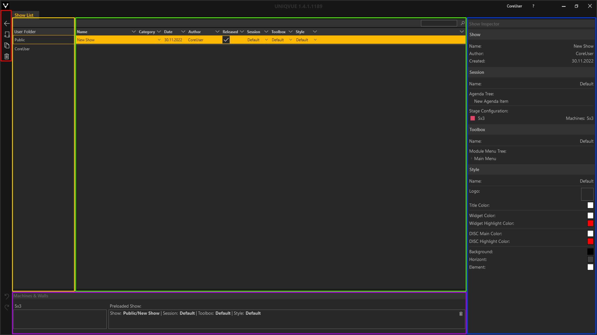
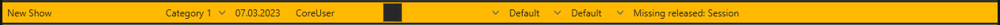

# Shows

*Shows* sind die Kernelemente von UNIQVUE und werden im *Showroom* über eine Playout Instanz ausgespielt. Der *Show* ist eine *Session* und die darin enthaltene *Agenda*, die Struktur Ihrer Präsentation zugewiesen. Über das Zuweisen eines *Styles* wird das gesamte Erscheinungsbild einer *Show* definiert. Durch Zuweisen einer *Toolbox* werden alle Funktionen Ihres Showroom-Systems festgelegt, die während Ihrer *Show* verfügbar sein sollen.

***
## Show List

 
Das *Show List* Fenster unterteilt sich in 5 Bereiche (farbig markiert). 

&#9711 **Allgemeine [Bedienelemente](005_bedienelemente.md)**

&#9711 **User Folder:**

Übersicht der öffentlichen und benutzerspezifischen Verzeichnisse, in denen *Shows* gespeichert sein können. Das öffentliche Verzeichnis ist für alle NutzerInnen des Computers einsehbar, wie bspw. Gastkonten. Das benutzerspezifische Verzeichnis ist nur für angemeldete NutzerInnen einsehbar, siehe [Administration](004_dashboard.md) in Abschnitt Dashboard.

&#9711 **Listenansicht:**

Listenansicht der verfügbaren *Shows* mit Suchfunktion - Die Eingabe ist sensitiv und filtert dynamisch die Liste entsprechend Ihrer Eingabe. Jedes Showobjekt in der Liste hat folgende Attribute:
<ul>
<li><b>Name:</b> Name der Show</li>
<li><b>Category:</b> Weisen Sie Ihre Show einer Kategorie zu. Kategorien werden kundenspezifisch und nach Absprache angelegt.</li>
<li><b>Date:</b> Erstellungsdatum</li>
<li><b>Author:</b> Accountname der Person, die die Show erstellt hat.</li>
<li><b>Released:</b> Freigabestatus - Nur freigegebene Shows können einer Playout Instanz zugewiesen werden.</li>
<li><b>Session:</b> aktuell zugewiesene Session</li>
<li><b>Toolbox:</b> aktuell zugewiesene Toolbox</li>
<li><b>Style:</b> aktuell zugewiesener Style</li>
<li><b>Info:</b> Informationen zur Show. Hier werden Sie u.a. auf nicht zugewiesene Sessions, Toolboxes oder Styles hingewiesen.

</li>
</ul>

&#9711 **Show Inspector:**

Der *Show Inspector* stellt die wichtigsten Informationen einer ausgewählten *Show* auf einen Blick bereit:
<ul>
<li><b>Show:</b> Kurzinfo zum Showobjekt</li>
<li><b>Session:</b> wichtigste Eigenschaften einer verknüpften Session</li>
<li><b>Toolbox:</b> wichtigste Eigenschaften einer verknüpften Toolbox</li>
<li><b>Style:</b> wichtigste Eigenschaften eines verknüpften Styles</li>
</ul>

&#9711 **Machines & Walls:**

Listenansicht der verfügbaren Playout Instanzen. Via Drag-and-drop können freigegebene *Shows* auf die Einträge in dieser Liste zugewiesen werden. 
***Wichtig: Es können mehrere Playout Instanzen mit einem identischen Displaysetup existieren. In der Liste werden Playout Instanzen, die die selben Eigenschaften des Displaysetups teilen als ein Eintrag zusammengefasst.* **
***
##Show Workflow

**Erstellen einer Show:**

Erstellen Sie eine *Show*. Ändern Sie den Namen und verknüpfen Sie eine *Session*, *Toolbox* und einen *Style* - Diese drei Elemente müssen einer *Show* zugeordnet sein.

<video width="99%" height="" autoplay loop muted markdown="1">
    <source src="img/Manager/Gifs/CreateShow.webm" type="video/webm" markdown="1">
</video>

**Show veröffentlichen:**

Setzen Sie den Haken bei Released. Die *Show* kann jetzt einer verfügbaren Playout Instanz zugeordnet werden.

<video width="99%" height="" autoplay loop muted markdown="1">
    <source src="img/Manager/Gifs/AssignShow.webm" type="video/webm" markdown="1">
</video>

***Hinweis: Die Session muss eine passende Stage Configuration enthalten, die sich mit dem physischen Displaysetup einer Playout Instanz deckt!*** 