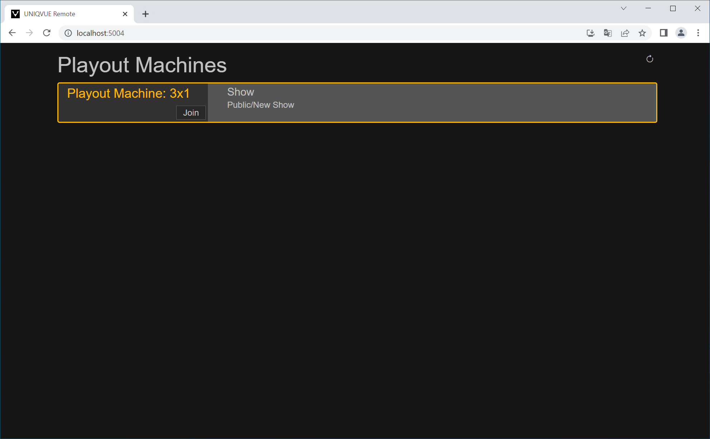
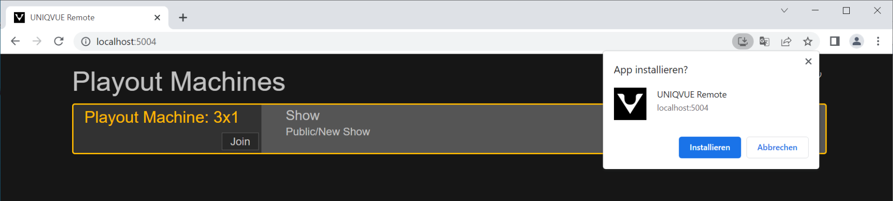
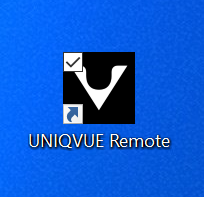
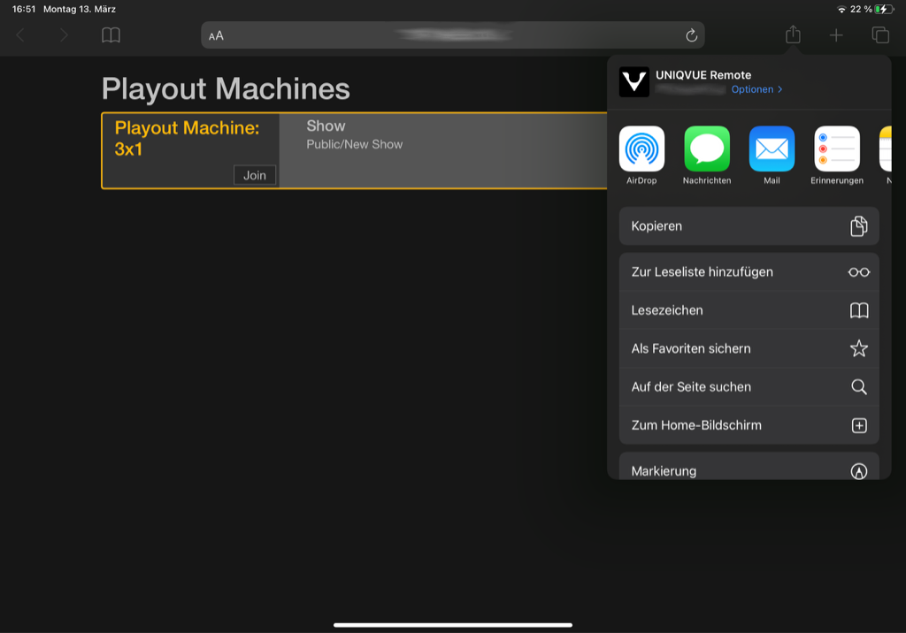
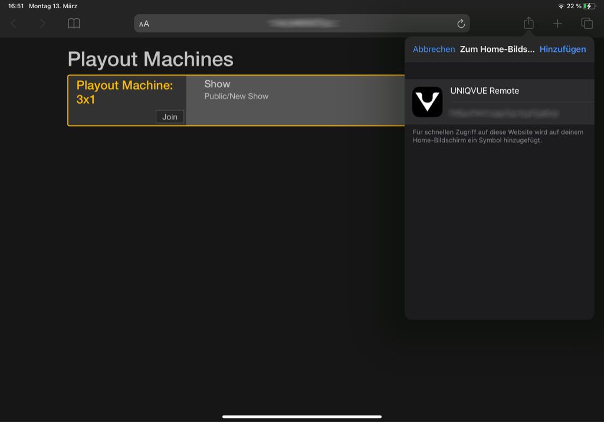
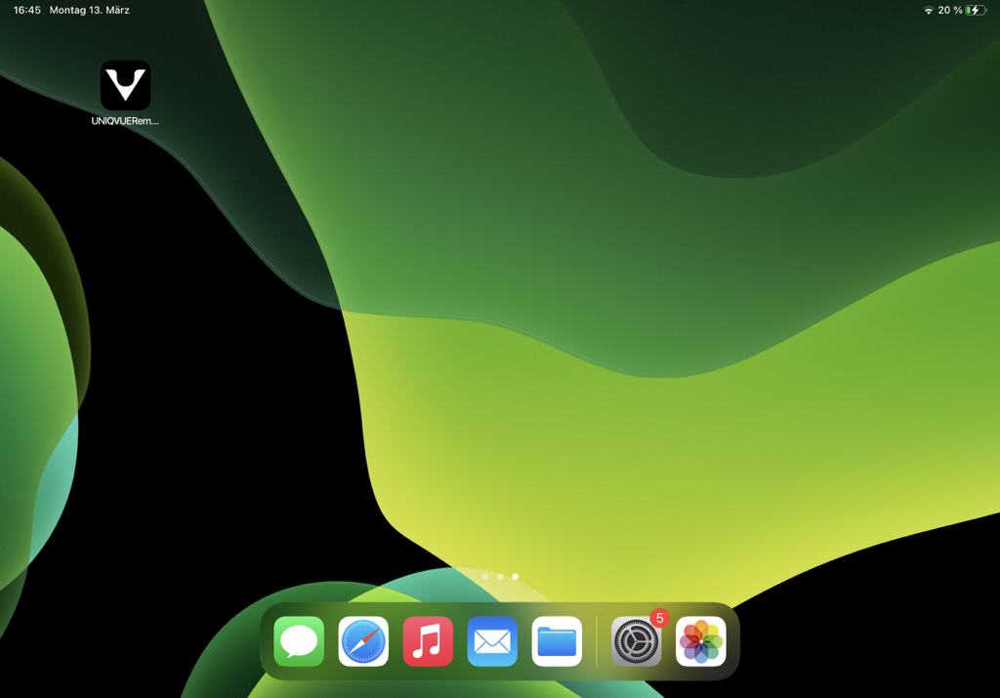

# UNIQVUE Remote

Mit der UNIQVUE Remote können Sie ein Uniqvue Playout über ein Web UI im Browser fernsteuern. Sie können diese Funktion mit jedem internetfähigen Gerät nutzen z.B. Ihrem persönlichen Smartphone, Tablet oder Laptop. Mit dieser Funktion sind Sie in der Lage die geladene [Show](00100_shows.md) eines Playouts zu kontrollieren. Im Wesentlichen navigieren Sie durch die [Agenda](056_agenda.md) einer mit der Show verknüpften Session. Analog zur normalen Bedienung via Toucheingabe an den Displays des Playouts, steuern Sie per Klick, gezielt in einzelne Agenda-Items.

***

# Einrichtung / Installation

Bei der Installation des [UNIQVUE Managers](002_uniqvuemanager.md) wird ein Server, der das Web UI bereitstellt, installiert. Nach der Installation läuft der Server im Hintergrund. UNIQVUE Remote steht nun zur Nutzung bereit. 

Surfen Sie im Browser Ihres Gerätes die IP-Adresse des Computers an, auf dem der UNIQVUE Manager installiert ist:

    http://xxx.xxx.xxx.xxx:5004

*Ihr Gerät muss sich hierfür im selben Netzwerk befinden, wie der Computer auf dem UNIQVUE Manager installiert ist. Für die genaue IP-Adresse wenden Sie sich an Ihre SystemadministratorInnen*

**PC**

Befinden Sie sich an dem Computer dem der UNIQVUE Manager läuft, können Sie das Web UI über folgende IP-Adresse erreichen: 

    http://localhost:5004

 

Nachdem Sie das Web UI in Ihrem Browser aufgerufen haben, können Sie nun UNIQVUE Remote als "App" auf Ihrem Gerät installieren. Klicken Sie dazu auf auf den "Installieren"  Button in der Adresszeile des Browsers:

Danach erscheint eine Verknüpfung auf Ihrem Desktop - Sie können ab jetzt auf den Browser verzichten und die App direkt hierüber starten.

Wird UNIQVUE Remote über die Appverknüpfung gestartet bietet das zudem den Vorteil, dass die App ohne Addresszeile des Browser dargestellt wird - Die IP-Adresse ist nicht direkt sichtbar!

***

**Mobile (iOS)**

Auf Mobilen Geräten können Sie UNIQVUE Remote ebenfalls als Appverknüpfung installieren. Für iOS Geräte funktioniert das wie folgt:

Nach dem Sie das Web UI einmal über den Browser aufgerufen haben, klicken Sie auf das "Teilen"-Symbol. Anschließend wählen Sie die Option "Zum Home-Bildschirm"... 

...und bestätigen danach mit "Hinzufügen".

Auf Ihrem Home-Bildschirm befindet sich nun das Appsymbol von UNIQVUE Remote.

