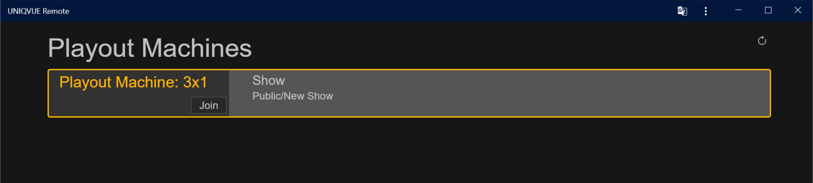
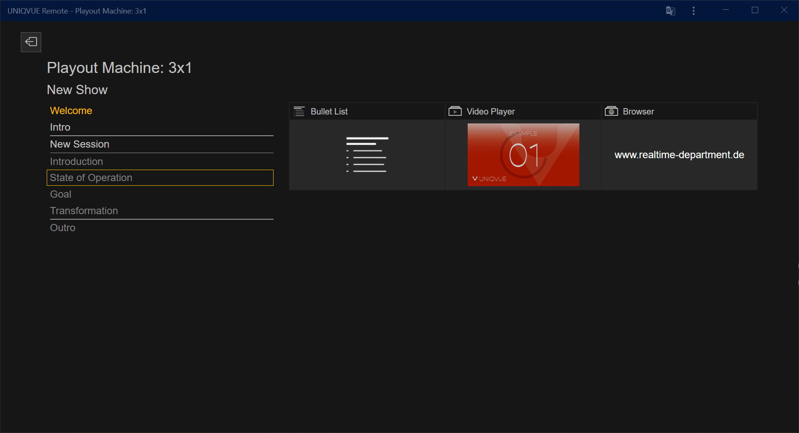
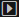

# User Interface

Die Übersichtsseite zeigt Ihnen eine Liste Ihrer verfügbaren Playout Instanzen an, welche jeweils eine Show ausspielen. Durch Betätigen des "Join"-Buttons verbinden Sie sich mit einer dieser Playout Instanzen und gelangen zur Steuerrungsseite.

Die Steuerungsseite zeigt zunächst den Namen der Playout Instanz, mit der Sie eine aktive Verbindung zur Steuerung hergestellt haben an. Darunter steht der Name der geladenen Show gefolgt von der Agenda der verknüpften Session. Rechts daneben (oder je nach verfügbarem Platz auch darunter) befindet sich ein Vorschau-Bereich. Der Vorschau-Bereich stellt die in einem Agenda Item enthaltenen Module mit ihrem [Slot-Layout](006_sessions.html#slot-layout-editor) dar. Verknüpfte Assets und Inhalte werden zusätzlich dargestellt, sodass Sie anhand der Darstellung unterscheiden können. 

***

# Steuerung

Die Elemente in der Liste können selektiert werden, wobei die aktuelle Selektion durch einen gelben Rahmen angezeigt wird. Wenn ein Punkt innerhalb der Agenda ausgewählt wurde, erscheint eine Vorschau im Vorschau-Bereich. Außerdem muss ein Element selektiert werden, bevor zu diesem gewechselt werden kann.

Für die Steuerung gelten folgende Regeln:

- Von Welcome kann zu Intro und Session gewechselt werden
- Von Intro kann zu Welcome und Session gewechselt werden
- Von der Session kann zu Welcome und Outro gewechselt werden *(Dies ist von jedem Agenda Item innerhalb der Session aus möglich)*
- Von Outro kann zu Welcome gewechselt werden

Wenn ein Element, zu dem ein Wechsel möglich ist, selektiert wurde, wird am Ende der Zeile ein "Take"-Button () eingeblendet. Ein einfacher Klick auf den Take-Button veranlasst den Wechsel.
