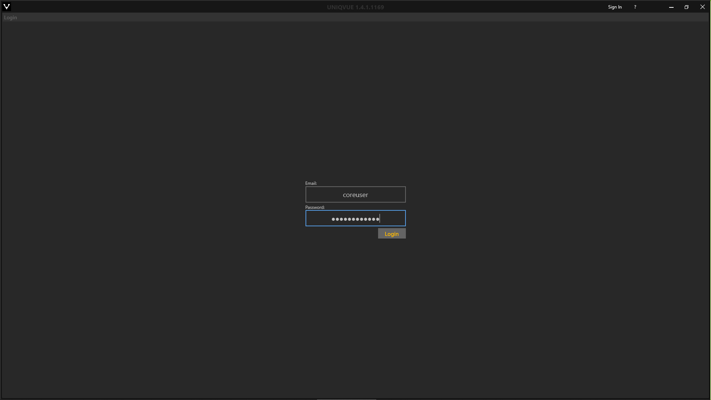

# Login

Nachdem dem Start des *UNIQVUE Managers* gelangen Sie in den Anmeldebereich.

Geben Sie Ihren Benutzernamen und das dazugehörige Passwort in die entsprechenden Felder ein um sich im [UNIQVUE Manager](002_sessionmanager.md) einzuloggen.
