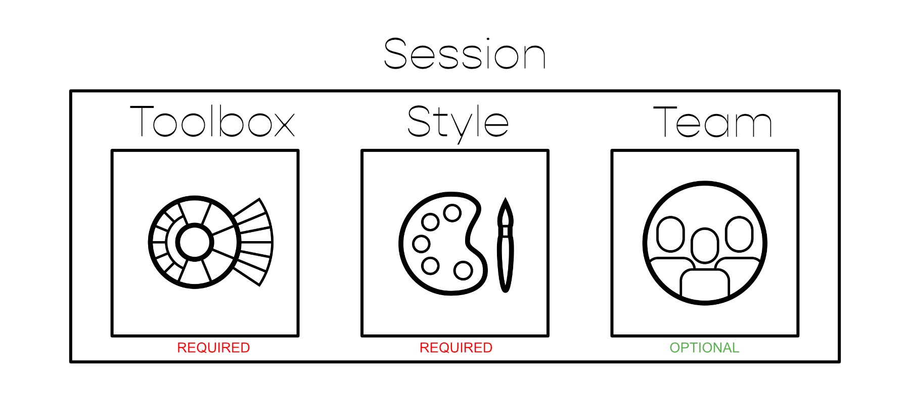

# Dashboard

 

<!---<video width="99%" height="540" autoplay loop muted markdown="1">
    <source src="../img/Manager/Gifs/Dashboard.webm" type="video/webm" markdown="1">
</video>--->

Ausgagspunkt für die gesamte Konfiguration der Funktionen in UNIQVUE ist der Manager. Nach dem Login gelangen Sie zum Dashboard. Hier zu sehen sind die Schaltflächen, welche weiter in die Bearbeitungsebenen der einzelnen "Elemente" führen.

## Session 

 

Grundsätzlich ist eine *Session* das übergeordnete Element sozusagen der Ursprung, welches weitere Elemente, namentlich eine *Disc (Toolbox)*, einen *Style* und ein Team beinhaltet . Während es zwingend notwendig ist eine Disc und einen Style einer Session zuzuweisen, ist ein Team optional.
Eine *Session* beinhaltet alle Elemente und Bedienkonzepte die man für eine Präsentation im *Showroom* benötigt. Kapitel [Session](006_sessions.md) liefert einen Überblick und in Kapitel [Session Workflow](051_sessionworkflow.md) wird erläutert wie Sie damit arbeiten.

***
## Toolboxes 

Eine *Toolbox oder DISC* ist eine jederzeit aufrufbare Bedienmöglichkeit, um auf alle Ressourcen und Funktionen zugreifen zu können. Kapitel [Toolboxes](007_toolbox.md) beinhaltet einen Überblick dazu und in Kapitel [Toolbox Workflow](052_toolboxworkflow.md) wird erklärt wie [Toolboxes](007_toolbox.md) erstellt und konfiguriert werden können. 

***
## Team Gallery 

Personalisieren Sie die Session Ihrer Taskforce und stellen Sie dazu ein entsprechendes Team zusammen. Ein Team kann mit nützlichen Informationen zu den einzelnen Team Membern angereichert werden. Erstellen und Konfigurieren von verschiedenen Teams wird in Kapitel [Team Gallery](008_teamgallery.md) erläutert. 

***
## Styles 

Der Style definiert das gesamte Erscheinungsbild Ihrer Session bzw. des Schowrooms. Erstellen Sie ihren persönlichen “Look and Feel”. Kapitel [Styles](009_styles.md) beinhaltet einen Überblick dazu und in Kapitel [Style Workflow](053_styleworkflow.md) wird erklärt wie Sessions erstellt und konfiguriert werden können. 

***
## Administration

In Administration lassen sich User-Accounts für UNIQVUE verwalten. Dieser Bereich ist nur für UserInnen sichtbar, welche Administratorrechte für UNIQVUE besitzen. Hier können User-Accounts erstellt und gelöscht werden. 

Einstellungen also Sessions, Toolboxes etc. werden in einem Ordner nur für eingeloggte UserInnen gespeichert. Es besteht aber auch die Möglichkeit gezielt Sessions für alle UserInnen verfügbar zu machen.

