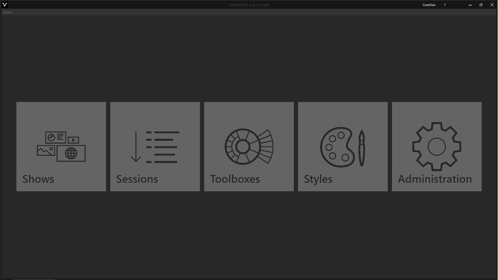

# Dashboard

 

Das *Dashboard* ist der Einstiegspunkt nach dem Login. Von hier aus gelangen Sie in die Bearbeitungsebenen der einzelnen Komponenten:
<ul>
	<li><b>Shows</b></li>
	<li><b>Sessions</b></li>
	<li><b>Toolboxes</b></li>
	<li><b>Styles</b></li>
	<li><b>Administration</b></li>
	
</ul>
***
## Shows 

Eine *Show* wird definiert durch einen Ablauf bzw. *Session*, der darin enthaltenden *Agenda*, einem *Style* und einer *Toolbox*.  

 

In Abschnitt [Shows](00100_shows.md) wird das Erstellen von *Shows* detailliert erläutert.

***
## Sessions

Eine *Sessions* wird definiert durch die darin enthaltende *Agenda*. Die *Agenda* ist der konkrete Ablauf Ihrer Präsentation, welche mit *Modulen* befüllt ist.

In Abschnitt [Sessions](006_session.md) wird das Erstellen von *Sessions* und *Agendas* detailliert erläutert.

***
## Toolboxes 

Eine *Toolbox oder DISC* ist eine jederzeit aufrufbare Bedienmöglichkeit, um auf alle Ressourcen und Funktionen zugreifen zu können. 

In Abschnitt [Toolboxes](007_toolbox.md) wird das Erstellen und Konfigurieren von *Toolboxes* detailliert erläutert.

***
## Styles 

Der *Style* definiert das gesamte Erscheinungsbild Ihrer *Show* bzw. des Schowrooms. Passen Sie Ihren Showroom situationsabhängig an z.B. für firmeninterne Seminare oder für Kundenbesuche. 

In Abschnitt [Styles](009_styles.md) wird das Erstellen und Konfigurieren von *Styles* detailliert erläutert.

***
## Administration

In [Administration](010_administration.md) lassen sich User-Accounts für UNIQVUE verwalten. Dieser Bereich ist nur für UserInnen sichtbar, welche Administratorrechte für UNIQVUE besitzen. Hier können User-Accounts erstellt und gelöscht werden. 

Einstellungen also *Shows*, *Sessions*, *Toolboxes* etc. werden in einem Ordner nur für eingeloggte UserInnen gespeichert. Es besteht aber die Möglichkeit gezielt diese Objekte für alle UserInnen verfügbar zu machen.

