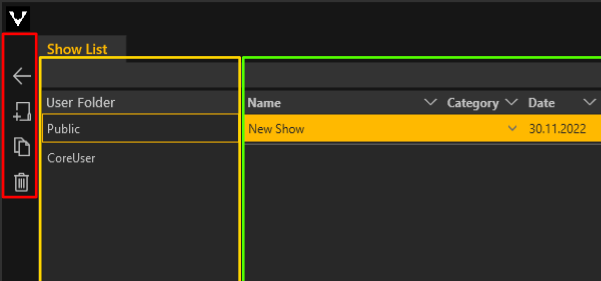
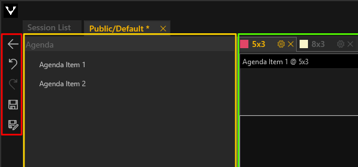

# Navigation und Tools

In jeder Listenansicht befinden sich folgende Bedienelemente am linken, oberen Rand:
<ul>
<li>
 Zurück zu Home
 </li>
<li>
 Ausgewählten Listeneintrag bearbeiten
</li>
<li>
 Neuen Listeneintrag erstellen
</li>
<li>
 Ausgewählten Listeneintrag duplizieren
</li>
<li>
 Ausgewählten Listeneintrag löschen
</li>
</ul>

***

Auf jeder Editorebene befinden sich zusätzlich folgende Bedienelemente:

<ul>
<li>
 Zurück zum vorherigen Fenster
 </li>
<li>
 Letzte Aktion rückgängig machen
</li>
<li>
 Vorherige Aktion wiederherstellen
</li>
<li>
 Bearbeitung speichern
</li>
<li>
 Bearbeitung speichern unter
</li>
</ul>

Einige der Funktionen lassen sich mit Tastenkombinationen ausführen:

- `STRG + S` Speichern
- `STRG + C` Element kopieren (in die Zwischenablage speichern)
- `STRG + V` neues Element aus Zwischenablage erstellen
- `STRG + Z` letzten Bearbeitungsschritt rückgängig machen
- `STRG + U` rückgängig gemachten Bearbeitungsschritt zurückholen
- `ENTF` Selektion löschen
- `F2` selektiertes Element umbenennen (in allen Listenansichten verfügbar)
- `STRG + N` neuen UserInnen-Account erstellen (nur Admin) 
