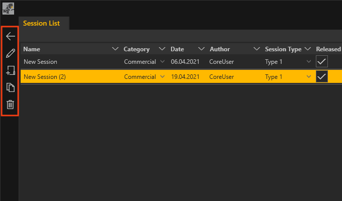

# Allgemeine Bedienelemente

Die Bedienelemente (rot markiert)

In jeder Listenansicht befinden sich folgende Bedienelemte am linken, oberen Rand:
<ul>
<li>
 Zurück zum vorherigen Fenster
 </li>
<li>
 Ausgewählten Listeneintrag bearbeiten
</li>
<li>
 Neuen Listeneintrag erstellen
</li>
<li>
 Ausgewählten Listeneintrag duplizieren
</li>
<li>
 Ausgewählten Listeneintrag löschen
</li>
<ul>

Die Icons dieser Liste finden sich im Session Manager in jeder Ebene an dieser Stelle wieder.
