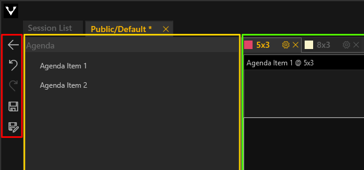

# Allgemeine Bedienelemente

In jeder Listenansicht befinden sich folgende Bedienelemte am linken, oberen Rand:
<ul>
<li>
 Zurück zum vorherige Ebene
 </li>
<li>
 Ausgewählten Listeneintrag bearbeiten
</li>
<li>
 Neuen Listeneintrag erstellen
</li>
<li>
 Ausgewählten Listeneintrag duplizieren
</li>
<li>
 Ausgewählten Listeneintrag löschen
</li>
</ul>

***

Auf jeder Editorebene befinden sich zusätzlich folgende Bedienelemente:

<ul>
<li>
 Zurück zum vorherigen Fenster
 </li>
<li>
 Letzte Aktion rückgängig machen
</li>
<li>
 Vorherige Aktion wiederherstellen
</li>
<li>
 Bearbeitung speichern
</li>
<li>
 Bearbeitung speichern unter
</li>
</ul>

