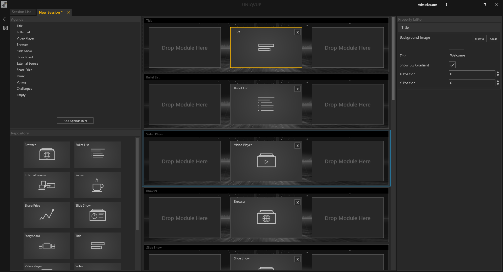

# Sessions 

*Sessions* beinhalten im Kern eine *Agenda*, der Ablauf Ihrer Präsentation. Sessions werden einer Show zugewiesen.

<!---
[Dashboard](004_dashboard.md) liefert dazu einen Überblick. 
-->
<!---Hier finden Sie einen allgemeinen Überblick zu *Sessions*.
-->
***
*Die Session List* 

 
Das *Session List* Fenster unterteilt sich in 4 Bereiche (farbig markiert).

**(Rot)** - Hier befinden sich die allgemeinen [Bedienelemente](005_bedienelemente.md).
***
**(Gelb)** - Übersicht der öffentlichen und benutzerspezifischen Verzeichnisse, in denen Sessions gespeichert sein können. Das öffentliche Verzeichnis ist für alle NutzerInnen des Computers einsehbar, wie bspw. Gastkonten. Das benutzerspezifische Verzeichnis ist nur für angemeldete NutzerInnen einsehbar, siehe [Administration](004_dashboard.md) in Abschnitt Dashboard.
***
**(Grün)** - Listenansicht der verfügbaren Sessions mit Suchfunktion - Die Eingabe ist sensitiv und filtert dynamisch die Liste entsprechend Ihrer Eingabe. Jede Session in der Liste hat folgende Attribute:
<ul>
<li><i>Name</i></li>
<li><i>Date</i></li>
<li><i>Category</i></li>
<li><i>Author</i></li>
<li><i>Type</i></li>
<li><i>Released (Freigabestatus)</i></li>
</ul>
***
**(Blau)** - Der *Session Inspector* stellt die wichtigsten Eigenschaften einer ausgewählten *Session* bereit. Mit dem ‘Edit Session’ Button gelangen Sie in die Bearbeitungsebene der *Session*, der *Session Editor*. 

***

Der *Session Editor*

Dieser besteht aus mehreren Bereichen.

* **Agenda:** Dieser zeigt die Struktur der Agenda als hierarchischen Baum. Im Showroom wird die konfigurierte [Agenda](056_agenda.md) grafisch dragestellt und bildet das zentrale Navigationselement einer Session. 
</li>  

* **Repository:** Enthält alle verfügbaren Module wie Slideshows etc. Detaillierte Informationen dazu sind in den Unterkapiteln von [Module](011_modulesoverview.md) zu finden .
</li>

* **Content Configuration:** Repräsentiert die Platzierung von Modulen auf dem Display Setup

* **Property Editor:** Hier werden die Eigenschaften eines ausgewählten Moduls dargestellt. Darüber hinaus werden auch die Eigenschaften des übergeordneten Agendapunktes gezeigt. Einzelne Agendapunkte können individuelle Eigenschfaften besitzen. 

Einen detaillierten Einstieg in den Workflow des *Session Editors* gibt es in Abschnitt [Session Worfklow](051_sessionworkflow.md). 
