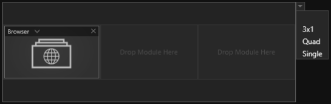

#Sessions 

*Sessions* beinhalten im Kern eine *Agenda*, der Ablauf Ihrer Präsentation. *Sessions* werden einer *Show* zugewiesen.

<!---
[Dashboard](004_dashboard.md) liefert dazu einen Überblick. 
-->
<!---Hier finden Sie einen allgemeinen Überblick zu *Sessions*.
-->
***
##Session List 

 
Das *Session List* Fenster unterteilt sich in 4 Bereiche (farbig markiert).

&#9711 **Allgemeine [Bedienelemente](005_bedienelemente.md)**

&#9711 **User Folder:** 

Übersicht der öffentlichen und benutzerspezifischen Verzeichnisse, in denen *Sessions* gespeichert sein können. Das öffentliche Verzeichnis ist für alle NutzerInnen des Computers einsehbar, wie bspw. Gastkonten. Das benutzerspezifische Verzeichnis ist nur für angemeldete NutzerInnen einsehbar, siehe [Administration](004_dashboard.md) in Abschnitt Dashboard.

&#9711 **Listenansicht:** 

Listenansicht der verfügbaren *Sessions* mit Suchfunktion - Die Eingabe ist sensitiv und filtert dynamisch die Liste entsprechend Ihrer Eingabe. Jede *Session* in der Liste hat folgende Attribute:
<ul>
<li><b>Name</b></li>
<li><b>Date</b></li>
<li><b>Category</b></li>
<li><b>Author</b></li>
<li><b>Type</b></li>
<li><b>Released</b> (Freigabestatus)</li>
</ul>

&#9711 **Session Inspector:**

Der *Session Inspector* stellt die wichtigsten Eigenschaften einer ausgewählten *Session* bereit. Mit dem ‘Edit Session’ Button gelangen Sie in die Bearbeitungsebene der *Session*, den *Session Editor*. 

***

##Session Editor

Der *Session* Editor besteht aus mehreren Bereichen (farbig markiert)

&#9711 **Agenda:** 

Dieser Bereich zeigt die Struktur der *Agenda* als hierarchischen Baum. Im Showroom wird die konfigurierte [Agenda](056_agenda.md) grafisch dragestellt und ist das zentrale Navigationselement einer *Session*. Jede *Agenda* kann für verschiedene Displaysetups bzw. 'Stage Configurations' angepasst werden. 

&#9711 **Stage Configuration:**

Dieser Bereich stellt jeden Agendapunkt und dessen zugeordneten Module grafisch so dar, wie es durch eine Playout Instanz und dessen Displaysetup ausgespielt würde. **Wichtig: Bevor Agendapunkte erstellt werden können muss mindestens eine 'Stage Configuration' der *Session* zugewiesen werden. Die Stage Configuration Profile, die zur Auswahl stehen, sind die der vorhandenen Displaysetups bzw. Playout Instanzen Ihres Showrooms.**

**Jedes Modul ist in einem Slot angeordnet. Ein Agendapunkt kann mehrere Slots mit verschiedener Anordnung beinhalten - 'Slot Layouts'**
    
 

&#9711 **Repository:**

Enthält alle verfügbaren Module wie Slideshows etc. Detaillierte Informationen dazu befinden sich in den Abschnitten von [Module](011_modulesoverview.md).

&#9711 **Property Editor:**

Hier werden entweder die Eigenschaften eines ausgewählten Moduls oder eines ausgewählten Agendapunktes angezeigt. Agendapunkte und Module besitzen individuelle Eigenschaften. Ist ein Agendapunkt ausgewählt gelangen Sie im Property Editor über den Button 'Layout Editor' in eine Einstellungsebene, in der Sie Slot Layouts erstellen können.
    
<!---

-->
***

##Slot Layout Editor

Der Slot Layout Editor besteht aus drei Bereichen (farbig markiert)

&#9711 **Object List:**

Übersicht der vorhandenen Slots mit Informationen zur aktuellen Größe und Anordnung eines Slots. Es lassen sich maximal 12 Slots pro Layout erzeugen.

&#9711 **Layout: **

Grafische Repräsentation der aktuellen Stage! Die angezeigten Slots können hier mit der Maus bearbeitet werden. 

&#9711 **Object Properties:** 

Hier wird Größe, Anordnung und Ankerpunkt eines Slots pixelgenau definiert. 

***
##Session Worklfow

**Erstellen einer neuen Session:**  

<video align="left" width="99%" height="" autoplay loop muted markdown="1">
<source src="img/Manager/Gifs/CreateSession.webm" type="video/webm" markdown="1">
</video>

**Session Editor öffnen und Stage Configuration auswählen:**

<video align="left" width="99%" height="" autoplay loop muted markdown="1">
<source src="img/Manager/Gifs/CreateStageConfig.webm" type="video/webm" markdown="1">
</video>

**Agendapunkte erzeugen:**

<video align="left" width="99%" height="" autoplay loop muted markdown="1">
<source src="img/Manager/Gifs/CreateAgendaItems.webm" type="video/webm" markdown="1">
</video>

Unter einem Agendapunkt können Sie weitere Agenda-Unterpunkte erzeugen. In der Hierarchie der *Agenda* werden Unterpunkte eingerückt dargestellt.  

<video align="left" width="99%" height="" autoplay loop muted markdown="1">
<source src="img/Manager/Gifs/FillAgendaSubItems.webm" type="video/webm" markdown="1">
</video>

**Agendapunkte mit Modulen füllen und Slot Layout auswählen**

<video align="left" width="99%" height="" autoplay loop muted markdown="1">
<source src="img/Manager/Gifs/FillAgendaItems.webm" type="video/webm" markdown="1">
</video>

**Module mit Inhalten füllen:** 

Klicken Sie auf ein Modul in einem Agendapunkt. Der *Property Editor* am rechten Rand zeigt Ihnen die Eigenschaften des Moduls an. Durch Klicken auf eine Eigenschaft öffnet sich der *Asset Browser*. Importieren Sie Bilder, HMTL-Dateien, Videos und viele andere Inhalte und wählen Sie diese aus. Wie der *Asset Browser* genauer funktioniert, lesen Sie im Abschnitt [Asset Browser](050_assetbrowser.md). Eine Übersicht über Module finden Sie im Abschnitt [Module](011_modulesoverview.md).

<video align="left" width="99%" height="" autoplay loop muted markdown="1">
<source src="img/Manager/Gifs/AddAsset.webm" type="video/webm" markdown="1">
</video>

**Session für andere Stage Configuration anpassen:**

Eine *Session* kann für jede Stage Configuration angepasst werden. Module, die bereits in einer Stage Configuration vorkommen sind mit dem Farbcode der Stage Configuration markiert.  

<video align="left" width="99%" height="" autoplay loop muted markdown="1">
<source src="img/Manager/Gifs/ColorCodingStageConfig.webm" type="video/webm" markdown="1">
</video>

**Speichern und veröffentlichen:**

Ist die *Session* nach Ihren Wünschen mit Modulen gefüllt muss sie gespeichert werden! Das Sternsymbol im Tab (‘\*’) zeigt an, ob es ungespeicherte Änderungen gibt. Durch Klicken auf das Diskettensymbol oder Drücken der Tastenkombination `STRG + S` wird die *Session* gespeichert. 

<video align="left" width="99%" height="" autoplay loop muted markdown="1">
<source src="img/Manager/Gifs/StoreAndRelease.webm" type="video/webm" markdown="1">
</video>

Durch Setzen des Hakens bei ‘Released’ wird die *Session* in der *Show List* verfügbar gemacht und kann so einer Show zugeordnet werden.

**Tipps und Tricks:**

Sie können ganz klassisch Module oder ein Listenelement aus der Agendahierarchie mit den Tastenkombinationen `STRG + C` und `STRG + V` in den Zwischenspeicher kopieren und wieder einfügen.
