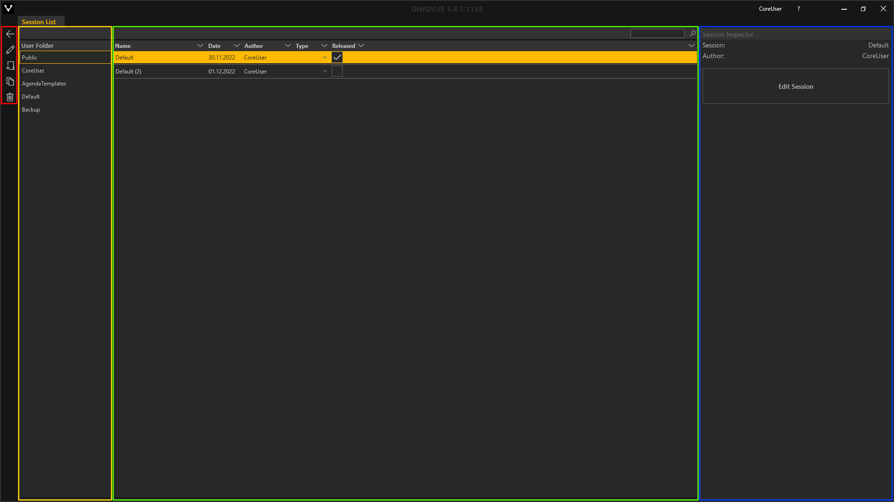
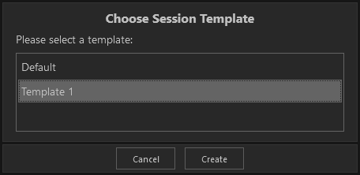
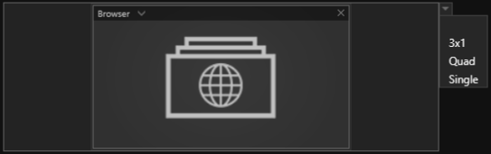
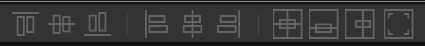

#Sessions 

*Sessions* beinhalten im Kern eine *Agenda*, der Ablauf Ihrer Präsentation. *Sessions* werden einer *Show* zugewiesen.

<!---
[Dashboard](004_dashboard.md) liefert dazu einen Überblick. 
-->
<!---Hier finden Sie einen allgemeinen Überblick zu *Sessions*.
-->
***
##Session List 

 
Das *Session List* Fenster unterteilt sich in 4 Bereiche (farbig markiert).

&#9711 **[Navigation und Tools](005_bedienelemente.md)**

&#9711 **User Folder:** 

Übersicht der öffentlichen und benutzerspezifischen Verzeichnisse, in denen *Sessions* gespeichert sein können. Das öffentliche Verzeichnis ist für alle NutzerInnen des Computers einsehbar, wie bspw. Gastkonten. Das benutzerspezifische Verzeichnis ist nur für angemeldete NutzerInnen einsehbar, siehe [Administration](004_dashboard.md) in Abschnitt Home.
Wenn Sie mit einem Administrator Account eingeloggt sind, sind die zusätzlichen Verzeichnisse "SessionTemplates", "Default" und "Backup" sichtbar. Im Bereich "SessionTemplates" können Sie Templates für Sessions erstellen. Befindet sich dort ein Eintrag wird nun beim Erstellen im öffentlichen und im User-Verzeichnis ein Auswahldialog eingeblendet, wo alle Templates aufgelistet sind.

&#9711 **Listenansicht:** 

Listenansicht der verfügbaren *Sessions* mit Suchfunktion - Die Eingabe ist sensitiv und filtert dynamisch die Liste entsprechend Ihrer Eingabe. Jede *Session* in der Liste hat folgende Attribute:
<ul>
<li><b>Name:</b> Name der Session</li>
<li><b>Date:</b> Erstellungsdatum</li>
<li><b>Author:</b> Accountname der Person, die die Session erstellt hat</li>
<li><b>Category:</b> Weisen Sie Ihre Session einem Typ zu. Typen werden kundenspezifisch und nach Absprache angelegt</li>
<li><b>Released:</b> Freigabestatus - Nur freigegebene Sessions können einer Show zugewiesen werden</li>
</ul>

&#9711 **Session Inspector:**

Der *Session Inspector* stellt die wichtigsten Eigenschaften einer ausgewählten *Session* bereit. Mit dem ‘Edit Session’ Button gelangen Sie in die Bearbeitungsebene der *Session*, den *Session Editor*. 

***

##Session Editor

Der *Session Editor* besteht aus mehreren Bereichen (farbig markiert)

&#9711 **Agenda:** 

Dieser Bereich zeigt die Struktur der *Agenda* als hierarchischen Baum. Im Showroom wird die konfigurierte [Agenda](056_agenda.md) grafisch dargestellt und ist das zentrale Navigationselement einer *Session*. Jede *Agenda* kann für verschiedene Displaysetups bzw. 'Stage Configurations' angepasst werden. 

&#9711 **Property Editor:**

Hier werden die individuellen Eigenschaften eines ausgewählten Elementes angezeigt. Abhängig davon von welcher Art das ausgewählte Element ist, stehen Ihnen hier zusätzliche Funktionen zur Verfügung, insbesondere der [Slot Layout Editor](006_sessions.html#slot-layout-editor).
<!-- Ist ein Agendapunkt ausgewählt gelangen Sie im Property Editor über den Button 'Layout Editor' in eine Einstellungsebene, in der Sie *Slot Layouts* erstellen können.  -->

&#9711 **Stage Configuration:**

Dieser Bereich stellt jedes *Agenda Item* und dessen zugeordneten Module grafisch so dar, wie es durch eine Playout Instanz und dessen Displaysetup ausgespielt würde. Jede Stage Configuration einer *Session* wird als Registrierkarte hinzugefügt, so lassen sich mehrere Stage Configurations parallel bearbeiten. Durch Klicken auf das Zahnradsymbol in der Registrierkarte der Stage Configuration erhalten Sie über den Property Editor Zugriff auf allgemeine Einstellungen:

<ul>
<li><b>Name:</b> Name der Stage Configuration</li>
<li><b>Color:</b> Markerfarbe der Registrierkarte um das Arbeiten mit mehreren Stage Configurations zu erleichtern</li>
<li><b>Height Factor:</b> Dieser Parameter dient dazu die Vorschau Stage Configuration zu skalieren</li>
<li><b>Default Background:</b> Auswahl eines Default Hintergrundthemas</li>
<li><b>Default Light Color:</b> Auswahl einer Default Lichtfarbe Ihres Showrooms</li>
<li><b>Default Slot Layout:</b> Öffnen des Slot Layout Editors</li>
</ul>

<video align="left" width="99%" height="" autoplay loop muted markdown="1">
<source src="img/Manager/Gifs/StageConfiguration_Scale.webm" type="video/webm" markdown="1">
</video>

 **Wichtig: Bevor *Agenda Items* erstellt werden können muss mindestens eine 'Stage Configuration' der *Session* zugewiesen werden. Die Stage Configuration Profile, die zur Auswahl stehen, entsprechen den vorhandenen Displaysetups bzw. Playout Instanzen Ihres Showrooms.**

&#9711 **Repository:**

Enthält alle verfügbaren Module wie Slideshows etc. Detaillierte Informationen dazu befinden sich in den Abschnitten von [Module](011_modulesoverview.md).

    
<!---

-->
***

##Slot Layout Editor

*Slots* definieren die Position und die Größe eines Moduls. Auf freie *Slots* können Module platziert werden. Ist ein *Slot* oder ein darauf platziertes Modul ausgewählt, steht im Property Editor die Möglichkeit bereit ein Hintergrundbild über den [Assetbrowser](050_assetbrowser.md) zuzuordnen. 

<!-- ##Slot Layout Editor -->

Module erstrecken sich über ein oder mehrere *Slots*. Ein *Agenda Item* kann mehrere *Slots* mit verschiedener Anordnung beinhalten - 'Slot Layouts'.
Über ein Dropdownmenü können Sie schnell 'Slot Layouts' auswählen. In der Auswahl sehen Sie alle verfügbaren 'Slot Layouts'. Sie können diese Auswahl erweitern, indem Sie Ihre eigenen *Slot Layouts* mit dem *Slot Layout Editor* erstellen.
    
|  |
|:--:|
| *Slot Layout 'Single'* |

|  |
|:--:|
| *Slot Layout '3x1'* |

Ist ein *Agenda Item* ausgewählt erscheint im *Property Editor* der Eintrag 'Slot Layout'. Mit dem Button 'Open' öffnen Sie in den *Slot Layout Editor*.
Alternativ erreichen Sie den *Slot Layout Editor* indem Sie die aktuelle 'Stage Configuration' selektieren. Dann erscheint im *Property Editor* ebenfalls der Eintrag 'Slot Layout'. Mit dem Button 'Open Editor' öffnen Sie in den *Slot Layout Editor*.

<video align="left" width="99%" height="" autoplay loop muted markdown="1">
<source src="img/Manager/Gifs/OpenSlotLayoutEditor.webm" type="video/webm" markdown="1">
</video>

*Hinweis: Öffnen Sie den Slot Layout Editor über ein Agenda Item, editieren Sie das Slot Layout nur für das selektierte Agenda Item. In diesem Falle werden Ihnen aktuell beinhaltete Module im Slot Layout Editor mit angezeigt. Öffnen Sie den Slot Layout Editor über die Stage Configuration editieren Sie das default Slot Layout der Stage Configuration. Bereits existierende Agenda Items bleiben davon unberührt nur beim Erzeugen neuer Agenda Items wird das Slot Layout als Template angewendet.    
<!--  -->

<!--  -->

Der *Slot Layout Editor* besteht aus drei Bereichen (farbig markiert)

&#9711 **Slot List:**

Die Slot List führt alle *Slots* in einer Liste auf. Der *Property Editor* zeigt Informationen zur aktuellen Größe und Anordnung eines ausgewählten *Slot*. Es lassen sich maximal 12 *Slots* pro Layout erzeugen.

Die *Slot List* verfügt neben den üblichen Funktionen Löschen, Duplizieren und Hinzufügen über zwei besondere Funktionen:

- Slot Splitting:

Diese Funktion bietet die Möglichkeit ein ausgewähltes *Slot* in weitere aufzuteilen. Dabei haben Sie die Wahl wieviele weitere Slots das Splitting erzuegen soll.

<video align="left" width="99%" height="" autoplay loop muted markdown="1">
<source src="img/Manager/Gifs/splitslot.webm" type="video/webm" markdown="1">
</video> 

- Array Copy

Diese Funktion bietet die Möglichkeit ein ausgewähltes *Slot* nach einem Anordnungsschema zu duplizieren. Dabei haben Sie zusätzlich die Wahl, ob eine Lücke (Offset) in horizontaler und vertikaler Richtung hinzugefügt werden soll.

<video align="left" width="99%" height="" autoplay loop muted markdown="1">
<source src="img/Manager/Gifs/arraycopyslot.webm" type="video/webm" markdown="1">
</video>

&#9711 **Layout: **

Grafische Repräsentation der aktuellen Stage! Die angezeigten *Slots* können hier mit der Maus in Position und Größe verändert werden. Mit gehaltener `STRG`-Taste und einem Klick können *Slots* gezielt einer Auswahl hinzugefügt und auch wieder entfernt werden. Mit gehaltener `SHIFT`-Taste und einem Klick fügen Sie mehrere *Slots* gleichzeitig einer Auswahl hinzu.

<video align="left" width="99%" height="" autoplay loop muted markdown="1">
<source src="img/Manager/Gifs/slotselection.webm" type="video/webm" markdown="1">
</video>

 *Slots* können einzeln oder gemeinsam in einer Auswahl verschoben oder skaliert werden. Ist die Checkbox 'Keep Aspect' im *Property Editor* aktiviert wird das Seitenverhältnis beim Skalieren beibehalten.

 <video align="left" width="99%" height="" autoplay loop muted markdown="1">
<source src="img/Manager/Gifs/singleslotscaling.webm" type="video/webm" markdown="1">
</video>

 <video align="left" width="99%" height="" autoplay loop muted markdown="1">
<source src="img/Manager/Gifs/multislotscaling.webm" type="video/webm" markdown="1">
</video>

<!--  -->

Zusätzlich dazu stellt der Layout Bereich eine Auswahl an Tool zur Verfügung um *Slots* mit einem Klick anzuordnen.

Bei den folgenden 6 Anordnungsmöglichkeiten wird das zuerst selektierte *Slot* als Referenz genommen!

- selektierte Slots am oberen Rand der Referenz anordnen
- selektierte Slots in der vertikalen Mitte der Referenz anordnen
- selektierte Slots am unteren Rand der Referenz anordnen

<video align="left" width="99%" height="" autoplay loop muted markdown="1">
<source src="img/Manager/Gifs/multislotalignment-1.webm" type="video/webm" markdown="1">
</video>

- selektierte Slots am linken Rand der Referenz  anordnen
- selektierte Slots in der horizontalen Mitte der Referenz anordnen
- selektierte Slots am rechten Rand der Referenz anordnen
  
<video align="left" width="99%" height="" autoplay loop muted markdown="1">
<source src="img/Manager/Gifs/multislotalignment-2.webm" type="video/webm" markdown="1">
</video>

Bei den restlichen 3 ist die Referenz immer die Stage!

- selektierte Slots in die Mitte der Stage verschieben
- selektierte Slots in die vertikale Mitte verschieben
- selektierte Slots in die horizontale Mitte verschieben
   
<video align="left" width="99%" height="" autoplay loop muted markdown="1">
<source src="img/Manager/Gifs/multislotalignment-3.webm" type="video/webm" markdown="1">
</video>

&#9711 **Property Editor:** 

Hier wird kann pixelgenau die Größe, Anordnung und prozentuale Skalierung eines *Slots* oder auch einer gesamten Auswahl definiert werden.

<video align="left" width="99%" height="" autoplay loop muted markdown="1">
<source src="img/Manager/Gifs/surgicalscale.webm" type="video/webm" markdown="1">
</video>

***
##Session Worklfow

**Erstellen einer neuen Session:**  

<video align="left" width="99%" height="" autoplay loop muted markdown="1">
<source src="img/Manager/Gifs/CreateSession.webm" type="video/webm" markdown="1">
</video>

**Session Editor öffnen und Stage Configuration auswählen:**

<video align="left" width="99%" height="" autoplay loop muted markdown="1">
<source src="img/Manager/Gifs/CreateStageConfig.webm" type="video/webm" markdown="1">
</video>

**Agenda Item erzeugen:**

<video align="left" width="99%" height="" autoplay loop muted markdown="1">
<source src="img/Manager/Gifs/CreateAgendaItems.webm" type="video/webm" markdown="1">
</video>

Unter einem Agenda Item können Sie weitere Agenda Items als Unterobjekte erzeugen. In der Hierarchie der *Agenda* werden Agenda Items als Unterobjekte eingerückt dargestellt.  

<video align="left" width="99%" height="" autoplay loop muted markdown="1">
<source src="img/Manager/Gifs/FillAgendaSubItems.webm" type="video/webm" markdown="1">
</video>

**Agenda Items mit Modulen füllen und Slot Layout auswählen**

<video align="left" width="99%" height="" autoplay loop muted markdown="1">
<source src="img/Manager/Gifs/FillAgendaItems.webm" type="video/webm" markdown="1">
</video>

**Module mit Inhalten füllen:** 

Klicken Sie auf ein Modul in einem Agenda Item. Der *Property Editor* am rechten Rand zeigt Ihnen die Eigenschaften des Moduls an. Durch Klicken auf 'Browse' öffnet sich der *Asset Browser*. Importieren Sie Bilder, HMTL-Dateien, Videos und viele andere Inhalte und wählen Sie diese aus. Wie der *Asset Browser* genauer funktioniert, lesen Sie im Abschnitt [Asset Browser](050_assetbrowser.md). Eine Übersicht über Module finden Sie im Abschnitt [Module](011_modulesoverview.md).

<video align="left" width="99%" height="" autoplay loop muted markdown="1">
<source src="img/Manager/Gifs/AddAsset.webm" type="video/webm" markdown="1">
</video>

**Session für andere Stage Configuration anpassen:**

Eine *Session* kann für jede Stage Configuration angepasst werden. Module, die bereits in einer Stage Configuration vorkommen sind mit dem Farbcode der Stage Configuration markiert.  

<video align="left" width="99%" height="" autoplay loop muted markdown="1">
<source src="img/Manager/Gifs/ColorCodingStageConfig.webm" type="video/webm" markdown="1">
</video>

**Speichern und veröffentlichen:**

Ist die *Session* nach Ihren Wünschen mit Modulen gefüllt muss sie gespeichert werden! Das Sternsymbol im Tab (‘\*’) zeigt an, ob es ungespeicherte Änderungen gibt. Durch Klicken auf das Diskettensymbol oder Drücken der Tastenkombination `STRG + S` wird die *Session* gespeichert. 

<video align="left" width="99%" height="" autoplay loop muted markdown="1">
<source src="img/Manager/Gifs/StoreAndRelease.webm" type="video/webm" markdown="1">
</video>

Durch Setzen des Hakens bei ‘Released’ wird die *Session* in der *Show List* verfügbar gemacht und kann so einer *Show* zugeordnet werden.

***

**Tipps und Tricks:**

Sie können ganz klassisch Module oder ein Listenelement aus der Agendahierarchie mit den Tastenkombinationen `STRG + C` und `STRG + V` in den Zwischenspeicher kopieren und wieder einfügen. 

Mit `STRG + Z` können Sie einen Bearbeitungsschritt rückgänging machen und mit `STRG + U` zurückholen.

