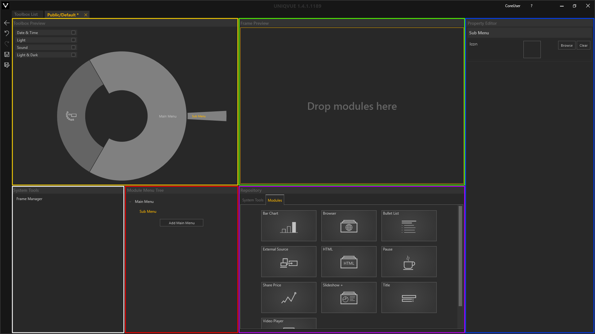
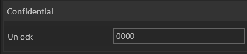
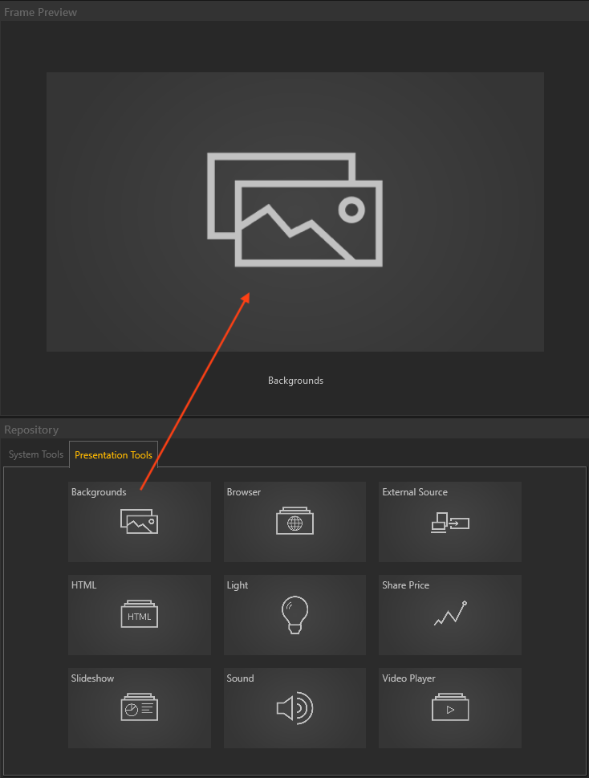
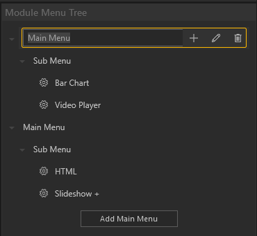

# Toolboxes

<!---

-->

Eine *Toolbox* ist für jede *Show* obligatorisch. Das heißt, sie muss zwingend einer *Show* zugewiesen sein. Die *Toolbox* ist das zentrale Bedienungswerkzeug und ist in jeder Phase in der Arbeit mit dem Showrooms zugänglich. Sie können die *Toolbox* individuell an ihren Workflow aus einem Repertoire an Funktionen und nützlichen Tools anpassen.

<!---

-->
***
##Toolbox List

 

Das *Toolbox List* Fenster unterteilt sich in 4 Bereiche (farbig markiert) 

&#9711 **Allgemeine [Bedienelemente](005_bedienelemente.md)**

&#9711 **User Folder:**

Übersicht der öffentlichen und benutzerspezifischen Verzeichnisse, in denen *Toolboxes* gespeichert sein können. Das öffentliche Verzeichnis ist für alle NutzerInnen des Computers einsehbar, wie bspw. Gastkonten. Das benutzerspezifische Verzeichnis ist nur für angemeldete NutzerInnen einsehbar, siehe [Administration](004_dashboard.md) in Abschnitt Dashboard.

&#9711 **Listenansicht:**

Listenansicht der verfügbaren *Toolboxes* mit Suchfunktion - Die Eingabe ist sensitiv und filtert dynamisch die Liste entsprechend Ihrer Eingabe. Jede *Toolbox* in der Liste hat folgende Attribute:
<ul>
<li><b>Name</b></li>
<li><b>Date</b></li>
<li><b>Author</b></li>
<li><b>Released (Freigabestatus)</b></li>
</ul>

&#9711 **Toolbox Inspector:**

Der *Toolbox Inspector* stellt die wichtigsten Eigenschaften einer ausgewählten *Toolbox* bereit. Mit dem ‘Edit Toolbox’ Button gelangen Sie in die Bearbeitungsebene der *Toolbox*, den *Toolbox Editor*. 

***

##Toolbox Editor

Der *Toolbox Editor* ist in mehrere Bereiche eingeteilt (farbig markiert) 

&#9711**Toolbox Preview:**

Dieser Bereich zeigt eine grafische Repräsentation der konfigurierten *Toolbox*.

&#9711 **Frame Preview:**

Hier werden die Module gezeigt, die in einem Menüpunkt gruppiert sind. Via Drag-and-drop können Module aus dem Repository einem Menüpunkt zugewiesen werden. 

&#9711 **Property Editor:**

Der Property Editor zeigt Parameter der aktuellen Selektion an, die geändert werden können.   

&#9711 **Repository:**

Dieser Bereich enthält Module, die in einer *Toolbox* zugewiesen werden können.

&#9711 **Module Menu Tree:**

Dieser Bereich strukturiert die Menüpunkte der *Toolbox* in einer Hierarchie. Unabhängig von der Session bzw. Agenda können hier verschiedene Module dynamisch in Ihre Show über die *Toolbox* verfügbar gemacht werden.

&#9711 **System Tools:**

Hier sind Funktionen gelistet, die anders als Module nur in einer *Toolbox* vorkommen können.
    
***

##System Tools

- **Frame Manager:**

    Hiermit können im Playout angezeigte Module schnell und einfach verteilt und angeordnet werden. Ein Frame Manager ist immer Teil einer *Toolbox*.

-  **Confidential:** 

    Verschleiert die Inhalte des gesamten Showrooms. Solange der Button aktiv ist sind keine Inhalte erkennbar. Dieser lässt sich dauerhaft einrasten. Durch Eingabe einer von Ihnen definierten Pin werden dann die Inhalte wieder freigegeben.

    Über den Property Editor können Sie dem Confidential Tool eine PIN geben.

    

- **Snap Shot:** 

    Erzeugt einen Screenshot des gesamten Showrooms.

- **Paint:**

    Freies Zeichnen auf dem Displaysetup. Verschiedene Farben stehen zur Auswahl. Außerdem kann die Pinselgröße eingestellt werden.

    Über den Property Editor legen Sie eine Voreinstellung für das Paint-Tools fest.

    

- **Microphone:**

    Falls ein Mikrofon zum Einsatz kommt, kann hiermit die Lautstärke im Playout reguliert werden.
   
Der Abschnitt [Disc](057_disc.md) erläutert wie die Tools im Showroom benutzt werden.

***
##Toolbox Workflow

**Erstellen einer neuen Toolbox:**  

Sie erstellen eine neue *Toolbox* durch Klicken auf das Dokument mit dem Pluszeichen. Mit Doppelklick auf den Namen können Sie diesen ändern.
<video width="99%" height="140" autoplay loop muted markdown="1">
    <source src="img/Manager/Gifs/CreateToolbox.webm" type="video/webm" markdown="1">
</video>

**Eine Toolbox anpassen:** 

Klicken Sie auf den Button 'Edit Toolbox' um in den *Toolbox Editor* zu gelangen.

Füllen Sie die *Toolbox* mit Modulen... 

<video width="99%" height="" autoplay loop muted markdown="1">
    <source src="img/Manager/Gifs/AddModulesToToolbox.webm" type="video/webm" markdown="1">
</video>

...und System Tools.

<video width="99%" height="" autoplay loop muted markdown="1">
    <source src="img/Manager/Gifs/AddSystemToolsToToolbox.webm" type="video/webm" markdown="1">
</video>

<!---

-->
**Inhalte verknüpfen:** 

Über den *Asset Browser* verknüpfen Sie Inhalte mit Modulen.

<video width="99%" height="" autoplay loop muted markdown="1">
    <source src="img/Manager/Gifs/AddAssetsToolbox.webm" type="video/webm" markdown="1">
</video>

**Menus benennen:** 

Durch Doppelklick auf den Namen eines Elementes in der Hierarchie, können Sie diesen ändern.  

<!---
-->

**Speichern und Veröffentlichen:** 

Ist die *Toolbox* nach Ihren Wünschen angepasst muss diese gespeichert werden! Das Sternsymbol im Tab ( \* ) zeigt Ihnen an, ob es ungespeicherte Änderungen gibt. Durch klicken auf das Diskettensymbol oder Drücken der Tastenkombination STRG + S wird die *Toolbox* gespeichert.

<video width="99%" height="" autoplay loop muted markdown="1">
    <source src="img/Manager/Gifs/SaveToolbox.webm" type="video/webm" markdown="1">
</video>

Durch Setzen des Hakens bei ‘Released’ wird die *Toolbox* in der Show List verfügbar gemacht und kann so einer *Show* zugeordnet werden.

