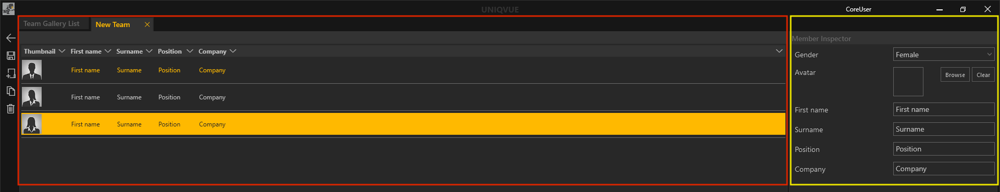

# Teams 

Teams sind optional für eine *Session*. Hiermit lassen sich jedoch *Sessions* mit Arbeitsgruppen bzw. einem Team verknüpfen. Tragen sie hier die MitarbeiterInnen ein, die eine Arbeitsgruppe in einer *Session* zu einem Projekt bilden.

Sie finden hier einen Überblick zu diesem Thema.

Die *Team Gallery List* 

 

Ausgangspunkt zum Erstellen eines Teams ist die *Team Gallery List*. Dieses Fenster unterteilt sich in vier Bereiche, die zur besseren Übersicht farbig umrandet sind. Ganz Links befinden sich die allgemeinen Bedienelemente. Daneben befindet sich eine Übersicht der öffentlichen und benutzerspezifischen Verzeichnisse. Das öffentliche Verzeichnis ist für alle NutzerInnen des Computers einsehbar, wie bspw. Gastkonten. Das benutzerspezifische Verzeichnis ist nur für angemeldete NutzerInnen einsehbar. Das Hauptfenster ist die Listenansicht der *Team Gallery*. Rechts daneben befindet sich der *Team Gallery Inspector*. 

Die *Team Gallery List* ist in mehrere Spalten unterteilt. Jede Spalte repräsentiert dabei eine allgemeine Eigenschaft der Team Gallery List. Teams können durch Klicken auf die jeweilige Eigenschaft in der Kopfzeile der Liste sortiert werden. 

 
1.    **Name** - Name des Teams. Durch Doppelklick kann dieser geändert werden. 

 

2.    **Date** - Beim Erstellen eines Teams wird automatisch das aktuelle Datum vergeben. Das hilft die Teams nach Datum zu sortieren und wiederzufinden. 

 

3.    **Author** - Automatisch wird hier die Person mit ihrem Username eingetragen. 

 

4.    **Released** - Teams, die mit einem Haken bei ‘Released’ markiert sind, werden in der *Session List* zur Auswahl verfügbar gemacht. In Kapitel [Sessions](006_sessions.md) unter *Session List* wird dies genauer erläutert.  

Initial befindet sich in der *Team Gallery List* der Eintrag ‘New Team’.  

Der *Team Gallery Inspector* auf der rechten Seite zeigt nochmal wichtige Eigenschaften im Überblick. 

Mit dem ‘Edit Team’ Button gelangen Sie in die Bearbeitungsebene des Teams, dem ‘Team Editor’. 

***

Der *Team Editor*

 

 
Der *Team Editor* ist in zwei Bereiche aufgeteilt, dem geöffneten Tab des zu bearbeitenden Teams als Listenansicht und dem *Member Inspector*, oben farbig umrandet. 

Durch Klicken des Icons mit dem Dokument und dem Pluszeichen wird ein neues Teammitglied erstellt. 

Rechts im *Member Inspector* können die individuellen Eigenschaften des Teammitglieds eingestellt werden. Folgende Eigenschaften sind zu vergeben:

* <b>Geschlecht</b>
***
* <b>Avatar</b> - Ein individuelles Bild, welches über den *Asset Browser* vergeben werden kann. Alles zum *Asset Browser* ist in Kapitel [Asset Browser](050_assetbrowser.md) nachzulesen. 
***
* <b>First Name</b>
***
* <b>Surname</b>
***
* <b>Position</b>
***
* <b>Company</b>
