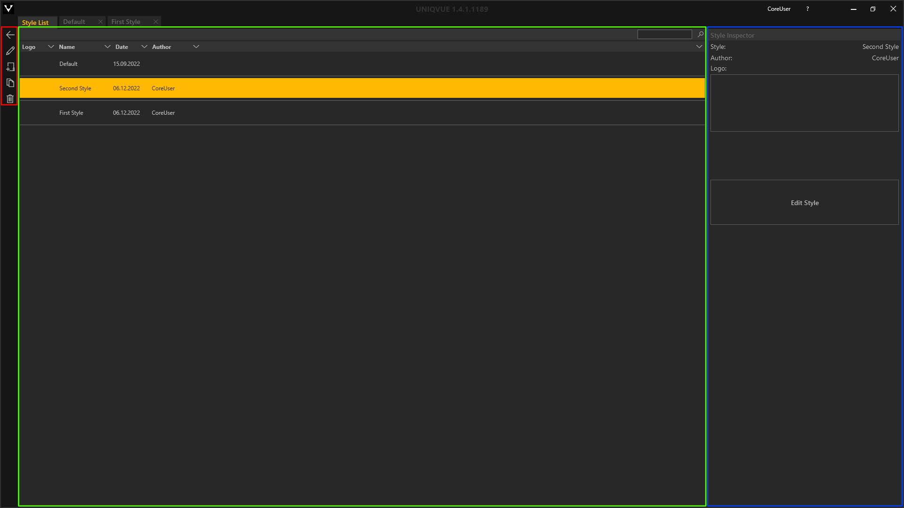
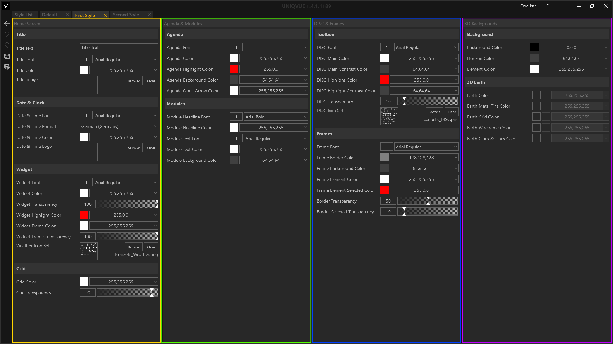

# Styles 

Ein *Style* ist für jede *Show* obligatorisch. Das heißt, ein *Style* muss zwingend einer *Show* zugewiesen werden. Der *Style* definiert das gesamte Erscheinungsbild des Showrooms. Über Schriftart, Lichtfarbe der Beleuchtung und Icons lassen sich weitere Parameter einstellen.  
***

##Style List  

 
Das *Style List* Fenster unterteilt sich in drei Bereiche (farbig markiert).

&#9711 **Allgemeine [Bedienelemente](005_bedienelemente.md)**

&#9711 **Listenansicht:** 

Listenansicht der verfügbaren *Styles* mit Suchfunktion - Die Eingabe ist sensitiv und filtert dynamisch die Liste entsprechend Ihrer Eingabe. 
Initial befindet sich in der *Style List* der Eintrag ‘Default’. Dieser ist an die Konfiguration Ihres Setups und der Corporate Identity Ihres Unternehmens angepasst. Jeder *Style* in der Liste hat folgende Attribute:
<ul>
<li><b>Logo:</b> Hier kann das Logo Ihres Unternehmens sein</li>
<li><b>Name:</b> Name des Styles</li>
<li><b>Date:</b> Erstellungsdatum</li>
<li><b>Author:</b> Automatisch wird hier der Username des eingeloggten Accounts eingetragen </li>
</ul>

&#9711 **Style Inspector:** 

Der *Style Inspector* stellt die wichtigsten Eigenschaften eines ausgewählten *Styles* bereit. Mit dem ‘Edit Style’ Button gelangen Sie in die Bearbeitungsebene des *Styles*, den *Style Editor*.
<!---
Die *Style List* ist in mehrere Spalten unterteilt. Jede Spalte repräsentiert dabei eine allgemeine Eigenschaft des *Styles*. *Styles* können durch Klicken auf die jeweilige Eigenschaft in der Kopfzeile der Liste sortiert werden. 

 

1.    **Logo** - Logo eines *Styles*.

 

2.    **Name** - Name des *Styles*. Durch Doppelklick kann dieser geändert werden. 

 

3.    **Date** - Beim Erstellen eines *Styles* wird automatisch das aktuelle Datum vergeben. Das hilft die *Styles* nach Datum zu sortieren und wiederzufinden. 

 

4.    **Author** - Automatisch wird hier der Username des eingeloggten Accounts eingetragen.
-->
 

***
##Style Editor

Der *Style Editor* ist in 4 Bereiche eingeteilt (farbig markiert), die die Eigenschaften der grafischen Elemente des Showrooms auflisten:

&#9711 **[Home Screen](055_homescreen.md):** 

Der Home Screen ist der Startpunkt einer *Show*. Von hier aus können Sie unter Anderem [Sessions](006_sessions.md) laden.

&#9711 **[Agenda & Modules](056_agenda.md):**

In diesem Bereich werden Styleeigenschaften für Agenden und Module definiert. 

&#9711 **[DISC & Frames](057_disc.md): **

Hier kann der Look der *Toolbox* angepasst werden. 

&#9711 **3D Backgrounds:** 

Das Aussehen des 3D-Hintergrundes einer *Show* kann hier durch einige Parameter angepasst werden.

***
##Style Workflow

**Erstellen eines neuen Styles:**  

Sie erstellen eine neuen *Style* durch Klicken auf das Dokument mit dem Pluszeichen. Mit Doppelklick auf den Namen können Sie diesen ändern. Durch Klicken auf das Stiftsymbol oder durch Klicken auf den ‘Edit Style’ Button gelangen Sie zum *Style Editor*.
<video width="99%" height="" autoplay loop muted markdown="1">
    <source src="img/Manager/Gifs/CreateStyle.webm" type="video/webm" markdown="1">
</video>

**Einen Style anpassen:** 

Nehmen Sie Änderungen an den Fraben, den Fonts und den Icons der einzelnen grafischen Elementen vor. Bei den Fontgrößen bedeutet 2 = maximale Skalierung.
<video width="99%" height="" autoplay loop muted markdown="1">
    <source src="img/Manager/Gifs/ModifyStyle.webm" type="video/webm" markdown="1">
</video>

**Icons Sets verknüpfen:** 

Unter den Kategorien *Widget* und *Toolbox* lassen sich ganze Icon-Sets ändern.
Wichtig dabei ist, dass die Icons als eine Tilemap vorliegen müssen. Eine Tilemap ist eine Textur, also Bilddatei in Form eines Pngs, welche in vordefinierten Schrittweiten, horizontal und vertikal eingeteilt ist. Die Textur ist also in ein Gitter eingeteilt, dessen Zellen alle gleich groß sind und jeweils die Pixelinformation eines Icons enthalten. Die hier vordefinierte Schrittweite beträgt 256 x 256 Pixel. Nur so ist gewährleistet, dass die einzelnen Texturen jedes Icons korrekt "ausgeschnitten" werden. 
<video width="99%" height="" autoplay loop muted markdown="1">
    <source src="img/Manager/Gifs/ModifyIconSetStyle.webm" type="video/webm" markdown="1">
</video>

**Styles Speichern und benennen:** 

Ist der *Style* nach Ihren Wünschen angepasst, muss dieser gespeichert werden. Das Sternsymbol im Tab (‘*’) zeigt Ihnen an, ob es ungespeicherte Änderungen gibt. Durch klicken auf das Diskettensymbol oder Drücken der Tastenkombination STRG + S wird der *Style* gespeichert.

**Tipps und Tricks**

Sie können einzelne Attribute im *Style Editor* mit den Tastenkombinationen `STRG + C` und `STRG + V` in den Zwischenspeicher kopieren und auf Attribute des gleichen Typs wieder anwenden. Hovern Sie dazu jeweils mit der Maus über den Namen des entsprechenden Attributs und drücken Sie die Tastenkombination.