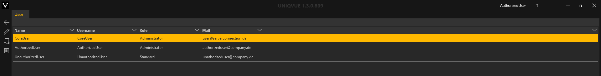
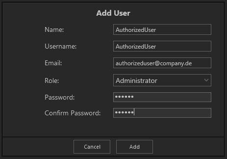

#  Administration

Administration ist der Bereich zur Verwaltung von UserInnen-Accounts. Dieser Bereich ist nur für UserInnen mit Administratorrechten zugänglich.
Hier können Sie UserInnen-Accounts verwalten. Dazu gehört:

 - Erstellen neuer UserInnen-Accounts
 - Löschen von UserInnen-Accounts
 - Bearbeiten von UserInnen-Accounts (Namensänderungen, Rechtevergabe, Passwortänderung)
 
 Diese Funktionen sind über die Toolleiste verfügbar.
 
 
 
 
 Beim Erstellen eines neuen Accounts öffnet sich eine Eingabemaske. Hier müssen folgende Eingaben gemacht werden:
 
 - Name
 - Username
 - Emailadresse
 - Role: Standard oder Administrator
 - Passwort
 
 
 
 
 Klicken Sie den 'Add'-Button um den Erstellungsvorgang abzuschließen.
 
 Gegebenenfalls werden Sie darauf hingewiesen Ihr Passwort an die Sicherheitsvorgaben anzupassen.
 
 

