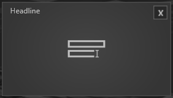
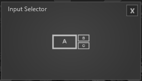

# Übersicht

  

	
  

  

	
  

   

	
  

   

	
  

   

	
  

   

	
  

   

	
  

   

	
  

   

	
  

   

	
  

   

	
  

   

	
  

  

	
  

 
     

	
  

  

*Module* treten an verschiedenen Stellen im *UNIQVUE Manager* auf. Der *Session Editor* hält alle *Module* bereit, um eine *Agenda* zu gestalten. Der *Toolbox Editor* enthält zusätzlich zu den Modulen, die auch im *Session Editor* existieren, weitere spezielle Module, die nur über die Toolbox erreichbar sind. In Abschnitt [Toolboxes](007_toolbox.md) wird darauf detailliert eingegangen. 

***

Module unterteilen sich grundsätzlich in zwei Kategorien, *Singleview* und *Multiview*.

 **Singleview Module** 

Diese *Module* nehmen maximal ein Slot eines [Slot Layouts](006_sessions.html#slot-layout-editor) ein. 

Alle Singleview *Module* teilen dieselben grundlegenden Eigenschaften: 

   - **Background Image:** Über den *Asset Browser* wird hier ein Hintergrundbild für dieses *Modul* geladen. Das Bild belegt dann das Display bzw. den gesamten Bereich in dem das Modul platziert wurde. 

   - **Size:** Hier wird die Größe der Darstellung des Fensters angegeben. Der Standardwert ist 0.75. Der Wert 1 entspricht Fullsize. 

   - **Title:** Titelvergabe eines *Moduls*. 

   - **Showtitle:** Durch Setzen des Hakens wird dieser Titel auch im Showroom angezeigt.  

***
**Multiview Module**

Je nach Setup des Showrooms verhalten sich die *Multiview Module* anders. Das wirkt sich hauptsächlich auf die Anordnung der Fenster aus und wird angezeigt, sobald das *Modul* in der Session per Drag and Drop platziert wird. Zudem wird in den Eigenschaften angezeigt welche Platzierungen mit Ihrem Showroom-Setup möglich sind. Grundsätzlich gilt: *Multiview Module* haben mehr als ein Fenster und halten dadurch zusätzliche Funktionen bereit. 
