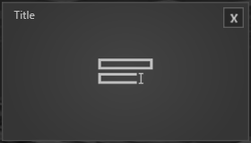
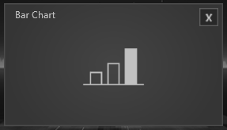
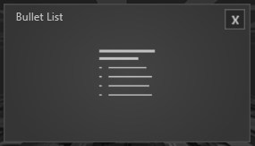
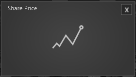
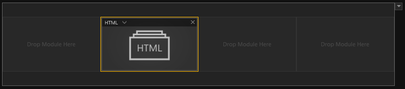
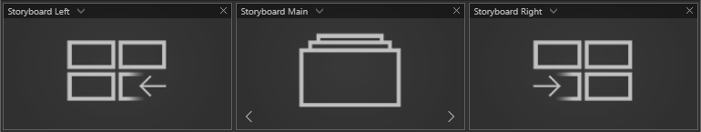
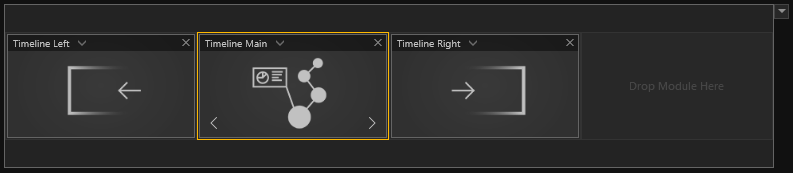

# Übersicht

*Module* treten an verschiedenen Stellen im *UNIQVUE Manager* auf. Im *Session Editor* stehen alle *Module* zur Verfügung, um eine *Agenda* zu gestalten. Der *Toolbox Editor* enthält zusätzlich zu den Modulen, die auch im *Session Editor* existieren, weitere spezielle Module, die nur über die *Toolbox* erreichbar sind. In Abschnitt [Toolboxes](007_toolbox.md) wird darauf detailliert eingegangen. 

Module unterteilen sich grundsätzlich in zwei Kategorien, *Singleview* und *Multiview*. Alle Module teilen einen Attribut: 

**Thumbnail** 

    
    

        <ul>
            <li><b>Thumbnail:</b> Hierüber lässt sich definieren, was für ein Icon die Darstellung des Moduls im <i>Session Editor</i> haben soll. Die Standardeinstellung ist 'Default Icon'.</li>
        </ul>
    

    
    

        <ul>
            <li>Ist 'Custom Thumbnail' ausgewählt, kann über den <i>Asset Browser</i> ein eigenes Icon ausgewählt werden.</li>
        </ul>
    

    
<!-- 

 -->

***
 **Singleview Module** 

 

  

	
  

  

	
  

   

	
  

   

	
  

   

	
  

   

	
  

   

	
  

   

	
  

   

	
  

     

	
  

Diese *Module* nehmen maximal ein Slot eines [Slot Layouts](006_sessions.html#slot-layout-editor) ein. 

<!-- Alle Singleview *Module* teilen dieselben grundlegenden Eigenschaften: 

   - **Background Image:** Über den *Asset Browser* wird hier ein Hintergrundbild für dieses *Modul* geladen. Das Bild belegt dann das Display bzw. den gesamten Bereich in dem das Modul platziert wurde. 

   - **Size:** Hier wird die Größe der Darstellung des Fensters angegeben. Der Standardwert ist 0.75. Der Wert 1 entspricht Fullsize. 

   - **Title:** Titelvergabe eines *Moduls*. 

   - **Showtitle:** Durch Setzen des Hakens wird dieser Titel auch im Showroom angezeigt.   -->

**Multiview Module**

 

  

	
  

  

	
  

  

*Multiview Module* können maximal 3 Slots einnehmen. Das Main Modul kann um jeweils ein weiteres Modul, links und rechts vom Main Modul, erweitert werden. Die Erweiterungsmodule lassen sich über die Pfeile im Main Modul ausklappen (siehe Abbildung).
<!-- Je nach Setup des Showrooms verhalten sich die *Multiview Module* anders. Das wirkt sich hauptsächlich auf die Anordnung der Fenster aus und wird angezeigt, sobald das *Modul* in der Session per Drag and Drop platziert wird. Zudem wird in den Eigenschaften angezeigt welche Platzierungen mit Ihrem Showroom-Setup möglich sind.  -->

***