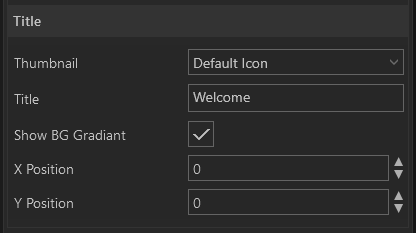
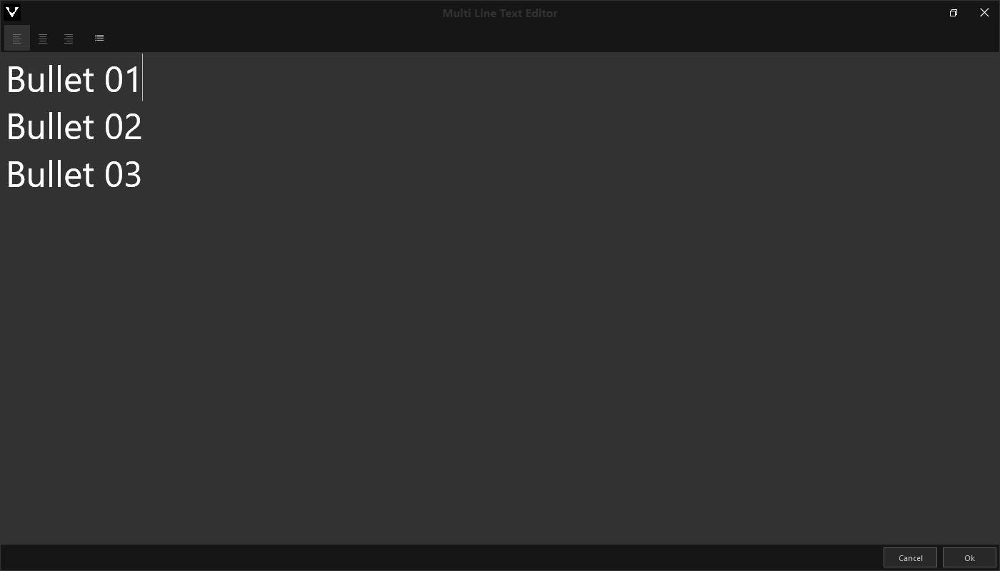

#Title

{align=center}

Geben Sie Ihrer Präsentation eine Überschrift/Titel und heißen Sie KollegInnen und TeilnehmerInnen Willkommen.

    
    

        <ul>
            <li><b>Title:</b> Über den internen Texteditor kann ein Titel geschrieben werden. Der Texteditor öffnet sich bei Klick auf das Textfeld.</li>
            <li><b>Show BG Gradient:</b> </li>
            <li><b>X / Y Position:</b>  </li>
        </ul>
    

Wie das Modul im Showroom dargestellt wird, finden Sie im Abschnitt *Showroom* unter [Agenda & Modules](056_agenda.html#title).

***
#Text Editor

 <!-- 

  

	
  

  

  <ul>
    <li><b>Title:</b> Über den internen Texteditor kann ein Titel geschrieben werden.</li>
    <li><b>Show BG Gradient:</b> </li>
    <li><b>X / Y Position:</b>  </li>
  </ul>

  

 -->