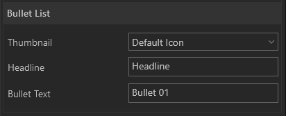

#Bullet List

Listen Sie wichtige Punkte in einer Bullet List auf.

    
    

        <ul>
            <li><b>Headline:</b> Über den internen Texteditor kann ein Titel geschrieben werden.</li>
            <li><b>Bullet Text:</b> Über den Texteditor schreiben Sie die Bulletpoints</li>
        </ul>
    

Wie das Modul im Showroom dargestellt wird, finden Sie im Abschnitt *Showroom* unter [Agenda & Modules](056_agenda.html#bullet-list).
***
#Text Editor

