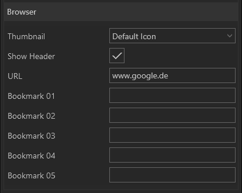

#Browser

 

Das Browser Modul bindet Chrome als vollwertigen Browser in Ihre Präsentation ein.

    
    

        <ul>
            <li><b>Show Header:</b> Der gesetzte Haken zeigt die URL-Leiste, Bookmarks etc. an.</li>
            <li><b>URL:</b> Hier kann eine Default-URL eintragen werden, die der Browser beim öffnen des Moduls lädt:
z.B. https://www.google.de</li>
            <li><b>Bookmark 1-5:</b> Hier tragen Sie URLs ein, die als Schnellauswahl-Buttons im Browser erscheinen.</li>
        </ul>
    

Wie das Modul im Showroom dargestellt wird, finden Sie im Abschnitt *Showroom* unter [Agenda & Modules](056_agenda.html#browser).

