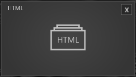
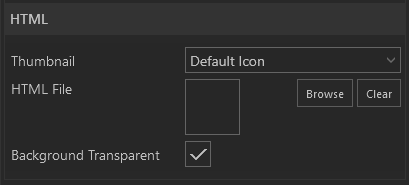

#HTML

 

Das HTML-Modul kann HTML Inhalte darstellen. 

    
    

        <ul>
            <li><b>HTML File:</b> Über den <a href="050_assetbrowser.html">Asset Browser</a> wählen Sie ein Verzeichnis aus, welches eine 'index.html' enthält.</li>
            <li><b>Background Transparent:</b> Durch Setzen des Hakens wird der Hintergrund der HTML-Darstellung transparent.  </li>
        </ul>
    

        
<b><em>Wichtig: Der gesamte Ordner, der die HTML-Dateien (bspw. 'Index.html') enthält muss als '.zip' komprimiert sein um ausgewählt werden zu können!

Außerdem ist bei den HTML-Dateien darauf zu achten, dass diese UTF-8 kodiert sind! Folgende Zeilen müssen daher in jeder HTML-Datei vorhanden sein um korrekt dargestellt zu werden.

    <!DOCTYPE html>
    <html>
    <head>
        <meta charset="UTF-8">
    </head>
    ...
    
</b><em/>

Wie das Modul im Showroom dargestellt wird, finden Sie im Abschnitt *Showroom* unter [Agenda & Modules](056_agenda.html#html).

