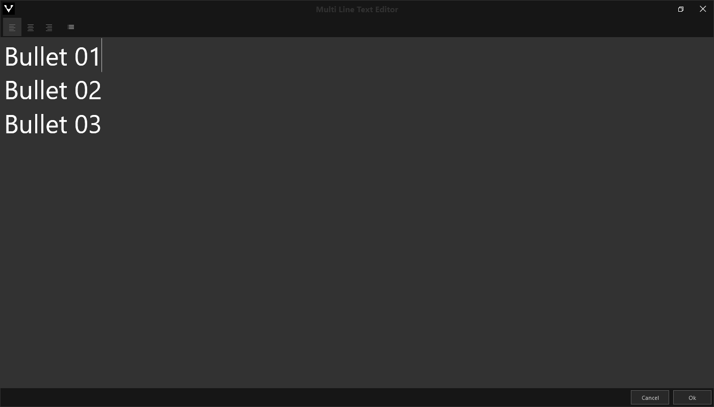

#Pause

 

Strukturieren Sie die Pausen in ihrer Präsentation mit diesem Modul.

    
    

        <ul>
            <li><b>Headline:</b> Über den internen Texteditor kann ein Titel geschrieben werden.</li>
            <li><b>Bullet Text:</b> Über den Texteditor schreiben schreiben Sie die Bulletpoints</li>
            <li><b>Timer:</b> Setzen Sie eine Zeit fest. Beim Öffnen des Moduls startet ein Timer.</li>
        </ul>
    

Wie das Modul im Showroom dargestellt wird, finden Sie im Abschnitt *Showroom* unter [Agenda & Modules](056_agenda.html#pause).
***
#Text Editor

