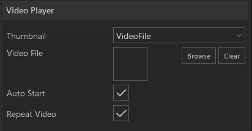

 

Binden Sie mit diesem Modul Videos in ihre Präsentation ein.

    
    

        <ul>
            <li><b>Video File:</b> Öffnet den <a href="050_assetbrowser.html">Asset Browser</a> zur Video Auswahl.</li>
            <li><b>Autostart:</b> Ist der Haken gesetzt startet das Video automatisch beim Öffnen des Moduls.</li>
            <li><b>Repeat Video:</b> Ist der Haken gesetzt wird das Video nach Ablauf erneut gespielt.</li>
        </ul>
    

Wie das Modul im Showroom dargestellt wird, finden Sie im Abschnitt *Showroom* unter [Agenda & Modules](056_agenda.html#video-player).
