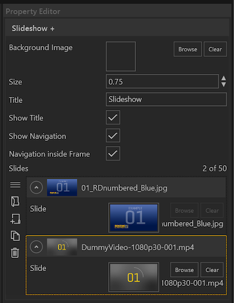
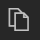

 

Sammlungen von bis zu 50 Videos und Bildern lassen sich mit diesem Modul einbinden.
Das Modul wird im Showroom über Wischgesten gesteuert.

•    **Background Image** - Die gesamte Slideshow kann mit einem Hintergrund hinterlegt werden. Klicken auf 'Browse' öffnet den Asset Browser.

•    **Size** - Ein Skalierungsfaktor zum Anpassen der Darstellung der Slideshow im Showroom. 

•    **Title** - Überschrift der Slideshow.

•    **Show Title** - Der gesetzte Haken zeigt den vergebenen Titel an.

•    **Show Navigation** - Der gesetzte Haken zeigt die Navigation an. 

•    **Navigation Inside Frame Slides** – Ein gesetzter Haken zeigt die Navigation im Bild an. 

Im Sessioneditor lassen sich Slides entweder einzeln oder gesammelt hinzufügen. Über den Assetbrowser lässt sich entweder ein ganzer Ordner mit Elementen auswählen, oder eine gezielte Multiauswahl wird getroffen. Die Funktionalität der Auswahl verhält sich, wie es unter Windows gewohnt ist (Strg + Auswahl, Shift + Auswahl).
Die zugewiesenen Slides werden im Property Editor als einzelne Listenelemente dargestellt. Die Reihenfolge der Elemente können via Drag and Drop verändert werden. Elemente können zudem gezielt dupliziert, gelöscht oder eingefügt werden.

        

<ul>
    <li>
 Asset Browser öffnen um mehrere Bild- oder Videodateien als neue Liste zu erstellen
 </li>
    <li>

         Neuen Listeneintrag am Ende erstellen
    
</li>
    <li>
 Neuen Listeneintrag duplizieren
</li>
    <li>
 Ausgewählten Listeneintrag löschen
</li>
</ul>

Informationen wie das Modul verwendet wird, finden Sie im Kapitel Showroom im Abschnitt Agenda/[Slideshow+](056_agenda/#slideshow).

