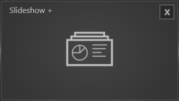
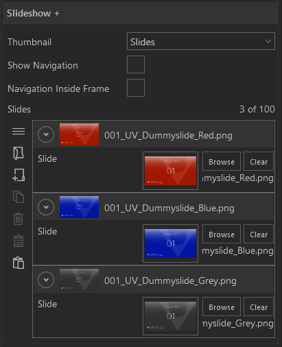

#Slideshow+

 

Sammlungen von bis zu 50 Videos und Bildern lassen sich mit diesem Modul einbinden.
Das Modul wird im Showroom über Wischgesten gesteuert.

    
    

        <ul>
            <li><b>Show Navigation:</b> Ist der Haken gesetzt werden Navigationselemente angezeigt.</li>
            <li><b>Navigation Inside Frame:</b> Ist der Haken gesetzt werden die Navigationselemente im Slide angezeigt.</li>
            <li><b>Slides:</b> Hier können Slides der Liste hinzugefügt werden.</li>
        </ul>
    

Im [Session Editor](006_sessions.html#session-editor) lassen sich Slides entweder einzeln oder gesammelt hinzufügen. Über den [Asset Browser](050_assetbrowser.md) lässt sich entweder ein ganzer Ordner mit Elementen auswählen oder mehrere Dateien über eine Multiauswahl. Die Funktionalität der Multiauswahl verhält sich, wie es unter Windows gewohnt ist (`STRG` + `Klick`, `SHIFT` + `Klick`).
Die zugewiesenen Slides werden im Property Editor als einzelne Listenelemente dargestellt. Die Reihenfolge der Elemente kann via Drag and Drop verändert werden. Elemente können zudem gezielt dupliziert, gelöscht oder eingefügt werden.

<!-- 

        

 -->

<ul>
    <li>
 Asset Browser öffnen um mehrere Bild- oder Videodateien als neue Liste zu erstellen
 </li>
    <li>

         Neuen Listeneintrag am Ende erstellen
    
</li>
    <li>
 Neuen Listeneintrag duplizieren
</li>
    <li>
 Ausgewählten Listeneintrag löschen
</li>
    <li>
 Kopieren eines Listenelementes mit Eigenschaften.
 </li>
    <li>
    

     Neuen Listeneintrag aus Kopie erzeugen.
 </li>
</ul>

Wie das Modul im Showroom dargestellt wird, finden Sie im Abschnitt *Showroom* unter [Agenda & Modules](056_agenda.html#slideshow).

