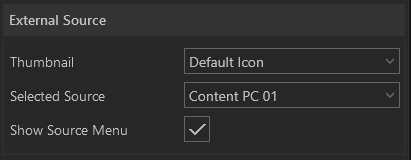

#External Source

 

Mit diesem Modul können Sie eine externe Quelle in Ihre Präsentation einbinden bzw. streamen.

    
    

        <ul>
            <li><b>Selected Source:</b> Über das Dropdownmenü können verfügbare Quellen ausgewählt werden.</li>
            <li><b>Show Source Menu:</b> Ist der Haken gesetzt, ist eine Quellenauswahl im Showroom sichtbar.</li>
        </ul>
    

Wie das Modul im Showroom dargestellt wird, finden Sie im Abschnitt *Showroom* unter [Agenda & Modules](056_agenda.html#external-source).
