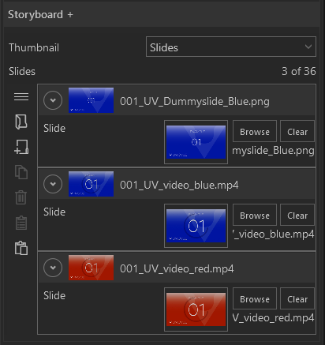
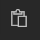
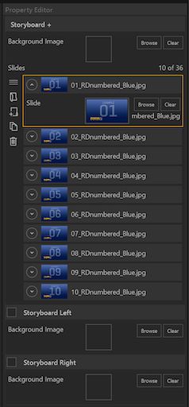

 
<!-- 
  -->

Dieses Modul kann aus bis zu 3 Slots bestehen. Im mittleren Main-Modul sind Slides 'gestapelt'. Durch Wischgesten nach rechts oder links werden Slides auf die Nebenmodule verteilt, die dort als Kachelansicht angeordnet werden. Maximal können 36 Slides in diesem Modul enthalten sein.

    
    

        <ul>
            <li><b>Slides:</b> Hier können Slides der Liste hinzugefügt werden.</li>
        </ul>
    

Im [Session Editor](006_sessions.html#session-editor) lassen sich Slides entweder einzeln oder gesammelt hinzufügen. Über den [Asset Browser](050_assetbrowser.md) lässt sich entweder ein ganzer Ordner mit Elementen auswählen oder mehrere Dateien über eine Multiauswahl. Die Funktionalität der Multiauswahl verhält sich, wie es unter Windows gewohnt ist (`STRG` + `Klick`, `SHIFT` + `Klick`).
Die zugewiesenen Slides werden im Property Editor als einzelne Listenelemente dargestellt. Die Reihenfolge der Elemente kann via Drag and Drop verändert werden. Elemente können zudem gezielt dupliziert, gelöscht oder eingefügt werden.

<ul>
    <li>
 Asset Browser öffnen um mehrere Bild- oder Videodateien als neue Liste zu erstellen
 </li>
    <li>

         Neuen Listeneintrag am Ende erstellen
    
</li>
    <li>
 Neuen Listeneintrag duplizieren
</li>
    <li>
 Ausgewählten Listeneintrag löschen
</li>
    <li>
 Kopieren eines Listenelementes mit Eigenschaften.
 </li>
    <li>
    

     Neuen Listeneintrag aus Kopie erzeugen.
 </li>
</ul>

Wie das Modul im Showroom dargestellt wird, finden Sie im Abschnitt *Showroom* unter [Agenda & Modules](056_agenda.html#storyboard).

<!-- 

        

<ul>
    <li>
 Asset Browser öffnen um mehrere Bild- oder Videodateien als neue Liste zu erstellen
 </li>
    <li>

         Neuen Listeneintrag am Ende erstellen
    
</li>
    <li>
 Neuen Listeneintrag duplizieren
</li>
    <li>
 Ausgewählten Listeneintrag löschen
</li>
</ul>

•    **Background Image** - Die gesamte Slideshow kann mit einem Hintergrund hinterlegt werden. Klicken auf 'Browse' öffnet den Asset Browser. 

•    **Storyboard Left** - Je nach Setup und Platzierung ist der Haken gesetzt. Außerdem kann für dieses Fenster separat ein Background Image mit dem Asset Browser ausgewählt werden. 

•    **Storyboard Right** - Je nach Setup und Platzierung ist der Haken gesetzt. Außerdem kann für dieses Fenster separat ein Background Image mit dem Asset Browser ausgewählt werden. 

Informationen wie das Modul verwendet wird, finden Sie im Kapitel Showroom im Abschnitt Agenda/ [Storyboard](056_agenda/#storyboard). -->

