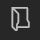
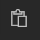

Dieses Modul verknüpft bis zu 36 Module in einer chronologischen Abfolge miteinander.
Dieses Modul bietet sich ideal an, um Zusammenhänge, kohärent und multimedial innerhalb eines Agenda-Items zusammenzubringen.

Für jede Station der Timeline stehen Ihnen folgende Module zur Verfügung:

- [Videoplayer](017_videoplayer.md)
- [Slideshow+](019_slideshowplus.md)
- [External Source](021_externalsource.md)
- [Browser](014_browser.md)
- [HTML](015_html.md)

    
    

        <ul>
            <li><b>Color:</b> Farbe der grafischen Elemente der Timeline.</li>
            <li><b>Line Animation:</b> Ist die Checkbox markiert, wird die Linie der Timeline animiert.</li>
            <li><b>Touch Animation:</b> Ist die Checkbox markiert, generieren die Touchereignisse im UI ringförmige Impulse.</li>
            <!-- <li><b>FX Animation: </b></li> -->
            

            <li><b>Items:</b> Hier kann eine gemischte Liste aus Modulen erstellt werden (Videoplayer, Slideshow+, External Source, Browser oder HTML). Module wie Slideshow+ etc. enthalten ebenfalls eine Liste - Diese verhalten sich genau so wie in den Modulen beschrieben.       
            Module in der Liste 'Items' haben zusätzliche Attribute:
            <ol>
                <li><b>Dot Label:</b> Text an einem Timelinepunkt.</li>
                <li><b>Content Label:</b> Überschrift über das in der Timeline eingebettete Modul.</li>
                <li><b>Module Type:</b> Über ein Dropdownmenü kann definiert werden, was für ein Modul das Listenelement sein soll.</li>
            </ol>
            </li>

        </ul>
    

Abhängig vom Listeneintrag im Abschnitt 'Items' lassen sich über den [Session Editor](006_sessions.html#session-editor) Inhalte entweder einzeln oder gesammelt hinzufügen. Über den [Asset Browser](050_assetbrowser.md) lässt sich entweder ein ganzer Ordner mit Elementen auswählen oder mehrere Dateien über eine Multiauswahl. Die Funktionalität der Multiauswahl verhält sich, wie es unter Windows gewohnt ist (`STRG` + `Klick`, `SHIFT` + `Klick`).
Die zugewiesenen Slides werden im Property Editor als einzelne Listenelemente dargestellt. Die Reihenfolge der Elemente kann via Drag and Drop verändert werden. Elemente können zudem gezielt dupliziert, gelöscht oder eingefügt werden.

<ul>
    <li>
 Asset Browser öffnen um mehrere Bild- oder Videodateien als neue Liste zu erstellen
 </li>
    <li>

         Neuen Listeneintrag am Ende erstellen
    
</li>
    <li>
 Neuen Listeneintrag duplizieren
</li>
    <li>
 Ausgewählten Listeneintrag löschen
</li>
    <li>
 Kopieren eines Listenelementes mit Eigenschaften.
 </li>
    <li>
    

     Neuen Listeneintrag aus Kopie erzeugen.
 </li>
</ul>

Wie das Modul im Showroom dargestellt wird, finden Sie im Abschnitt *Showroom* unter [Agenda & Modules](056_agenda.html#timeline).

<!-- 

        

<ul>
    <li>

         Neues Modul zur Timeline hinzufügen
    
</li>
    <li>
 Listeneintrag bzw. Modul duplizieren
</li>
    <li>
 Ausgewählten Listeneintrag bzw. Modul löschen
</li>
</ul>

- **Color** - Die Farbe der Timeline.
- **Line Animation** - Ist die Checkbox markiert, wird die Linie der Timeline animiert.
- **Touch Animation** - Ist die Checkbox markiert, generieren die Touchereignisse im UI ringförmige Impulse. 
- **FX Animation** - Ist die Checkbox markiert, wird das aktuelle Modul, skaliert und transparent im Hintergrund angezeigt. Zusätzlich enthält diese Ebene einen "The Matrix"-ähnlichen Texteffekt.  -->
