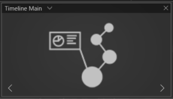

Dieses Modul verknüpft bis zu 36 Module in einer chronologischen Abfolge miteinander.
Dieses Modul bietet sich ideal an, um Zusammenhänge, kohärent und multimedial innerhalb eines Agendapunktes zusammenzubringen.

Für jede Station der Timeline stehen Ihnen folgende Module zur Verfügung:

- [Videoplayer](017_videoplayer.md)
- [Slideshow+](019_slideshowplus.md)
- [Live Input(External Source)](021_externalsource.md)
- [Browser](014_browser.md)
- [HTML](015_html.md)

        

<ul>
    <!---<li>
 Asset Browser öffnen um mehrere Bild- oder Videodateien als neue Liste zu erstellen
 </li>--->
    <li>

         Neues Modul zur Timeline hinzufügen
    
</li>
    <li>
 Listeneintrag bzw. Modul duplizieren
</li>
    <li>
 Ausgewählten Listeneintrag bzw. Modul löschen
</li>
</ul>

- **Color** - Die Farbe der Timeline.
- **Line Animation** - Ist die Checkbox markiert, wird die Linie der Timeline animiert.
- **Touch Animation** - Ist die Checkbox markiert, generieren die Touchereignisse im UI ringförmige Impulse. 
- **FX Animation** - Ist die Checkbox markiert, wird das aktuelle Modul, skaliert und transparent im Hintergrund angezeigt. Zusätzlich enthält diese Ebene einen "The Matrix"-ähnlichen Texteffekt. 
