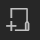

 

Mit dem Icon Array Modul können Sie bis zu 12 Icons jeweils mit einem Textinhalt verbinden. Durch Touchinteraktion mit einem Icon wird der verknüpfte Text freigelegt. Ob ein zuvor freigelegter Text durch Touch auf ein anderes Icon wieder verschwindet kann eingestellt werden.

Je nach Anzahl der Icons werden diese im Playout automatisch angeordnet. Jedes Icon und dessen verknüpfter Textinhalt werden im Property Editor als Element in einer Liste repräsentiert.

    

    <ul>
        <li><b>Text Alignment:</b> Über das Dropdownmenü lässt sich definieren, ob die Titeltexte oben, unten, links oder rechts angeordnet sein sollen.
        </li>
        <li><b>Icon Size (%):</b> Hiermit können Sie die Icons individuell skalieren.
        </li>
        <li><b>Only One Active:</b> Durch Setzen des Hakens an dieser Stelle wird bei Touch auf ein anderes Icon der Textinhalt des zuvor aktivierten Icons wieder ausgeblendet. Ist der Haken nicht gesetzt ist das Verhalten der Icons unabhängig voneinander.
        </li>
        <li><b>Use Highlight Color:</b> Hiermit definieren Sie, ob ein aktiviertes Icon farbig hervorgehoben werden soll.
        </li>
        

        Der Abschnitt 'Icon Sets' ist eine Liste. Jedes Listenelement entspricht einem interaktiven Icon mit folgenden Attributen:
        

        <li><b>Icon:</b> Die verknüpfte Bilddatei</li>
        <li><b>Title Text:</b> Titel des Icons</li>
        <li><b>Color:</b> Content Text</li>
        <li><b>Textbox Width (%):</b> Größe des Content Texts in die Breite.</li>
    </ul>

<ul>
    <li>
    

         Neuen Listeneintrag am Ende erstellen
    

    </li>
    <li>
    

     Neuen Listeneintrag duplizieren
</li>
    <li>
    

     Ausgewählten Listeneintrag löschen
</li>
    <li>
    

     Kopieren eines Listenelementes mit Eigenschaften.
 </li>
    <li>
    

     Neuen Listeneintrag aus Kopie erzeugen.
 </li>
</ul>

Wie das Modul im Showroom dargestellt wird, finden Sie im Abschnitt *Showroom* unter [Agenda & Modules](056_agenda.html#icon-array).

