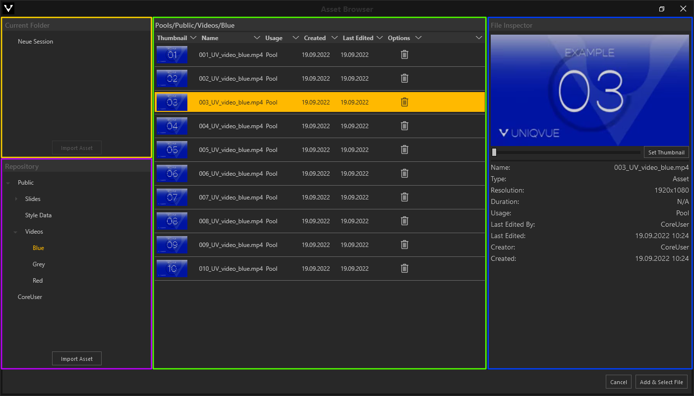

# Asset Browser

***

Der *Asset Browser* ist in 4 Bereiche eingeteilt (farbig markiert).

&#9711 **Current Folder:**

*Current Folder* zeigt die Ordnerstruktur der aktuellen Bearbeitungsebene. Ist der Asset Browser aus dem *Session Editor* geöffnet worden, ist das Rootverzeichnis der Name der aktuellen Session. Importierte Assets werden hier aufgelistet. Ausserdem können hier neue Ordner angelegt werden, um importierte Assets zu sortieren. 

&#9711 **Repository:**

*Repository* listet Verzeichnisse auf, in denen Dateien liegen, die über andere *Sessions* hinaus verwendet werden können.

&#9711 **Assetliste:**

Die Assetliste zeigt die Dateien des ausgewählten Ordners. 

&#9711 **File Inspector:**

Der *File Inspector* zeigt die Eigenschaften einer ausgewählten Datei an. Zusätzlich dazu wird eine Miniaturvorschau in Form eines Icons oder eines Thumbnails bereitgestellt. Bei Videos ist es zudem möglich über einen Slider eine Stelle des Videos als Thumbnail auszuwählen.

***
Der *Asset Browser* öffnet sich an allen Stellen im *UNIQVUE Manager*, an denen Sie Assets zuweisen. Der *Asset Browser* verhält sich konsistent und ist kontextbezogen. Das bedeutet, dass der *Asset Browser* automatisch nach entsprechenden Dateien filtert. Möchten Sie zum Beispiel ein Video im Modul [Video Player](017_videoplayer.md) laden, so werden auch nur Videodateien angezeigt. Entsprechend werden keine Bild- oder Audiodateien angezeigt. 

Verknüpfen Sie ein Asset aus den Ordnern 'Public' oder 'User' im Verzeichnis *Repository*, ändert sich der Button 'Select File', unten rechts im *Asset Browser* zu 'Add & Select File'. Das hat den Hintergrund, dass hier lediglich eine Referenz erzeugt wird! Die Ordner 'Public' und 'User' sind dafür gedacht allgemein zugängliche Daten wie bspw. einen Imagefilm verfügbar zu halten. Daten aus diesen Ordnern werden also nicht in eine *Session* importiert. Für den Fall jedoch, dass ein Original später im 'Public' Ordner gelöscht werden sollte, bleibt das zugewiesene Asset in einer *Session, Toolbox, Style* davon unberührt!

<video align="left" width="99%" height="" autoplay loop muted markdown="1">
<source src="img/Manager/Gifs/AddSelectFile.webm" type="video/webm" markdown="1">
</video>

Neben einzelnen Assets können Sie auch ganze Ordnerstrukuren importieren. Wählen Sie dazu "Import Asset" - Der Windows Explorer wird geöffnet. Ziehen Sie nun per Drag-and-Drop einen Ordner mit Assets in den Assetbrowser.

<video align="left" width="99%" height="" autoplay loop muted markdown="1">
<source src="img/Manager/Gifs/Assetbrowser_Import_Folder.webm" type="video/webm" markdown="1">
</video>

***Hinweis: Der Assetsbrowser unterstützt eine maximale Dateiengröße von 2 GB!***

***

# Unterstützte Dateienformate

**Image:**

- jpg, jpeg, png, dds, bmp

**Video:**

- mp4, mov

**Excel:**

- xls, xlsx
  
**Web:**

- zip (muss html enthalten)   

