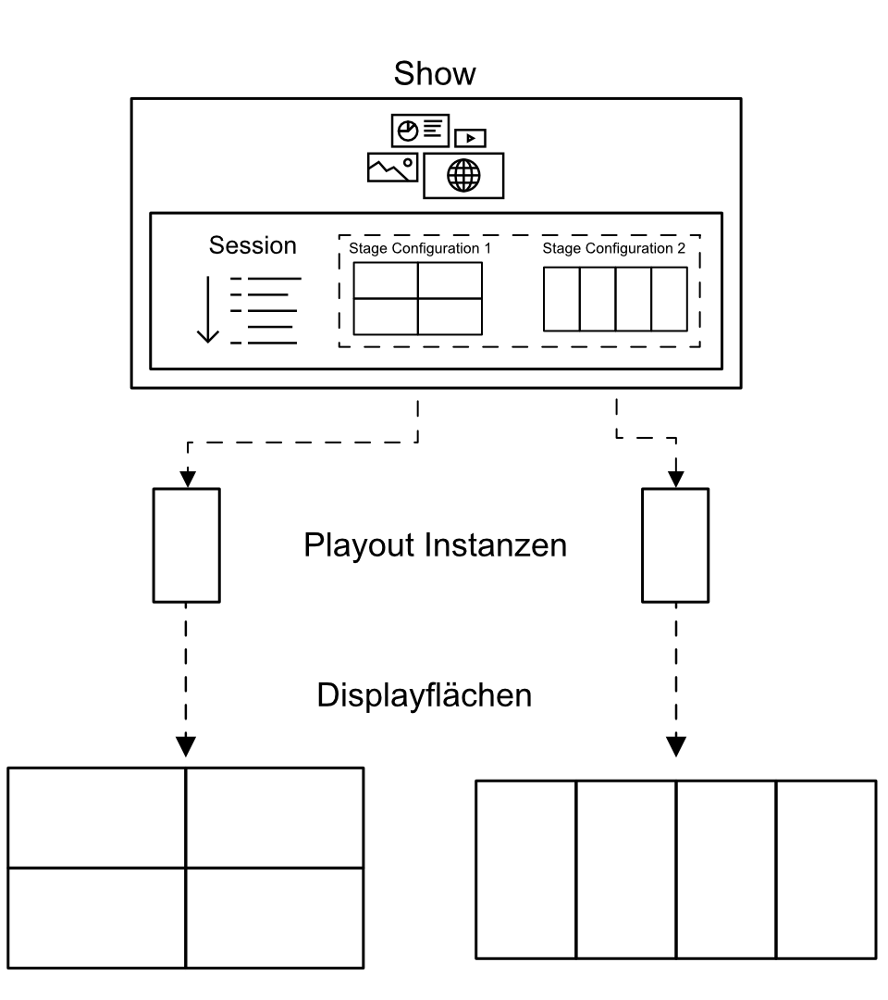

# Showroom Übersicht

Der Showroom ist neben dem Manager der zweite zentrale Bestandteil von UNIQVUE. Ein Showroom wird im Kern als ein Displaysetup begriffen auf dem eine Show durch eine physische Playout-Instanz (Rechner) angepasst ausgespielt wird. Der Showroom kann aber auch aus mehreren unterschiedlichen Displaysetups bestehen. Mit UNIQVUE besteht die Möglichkeit, unabhängig der Größe und Zusammensetzung der Displayflächen Ihre Shows angepasst auszuspielen.

Um dies zu gewährleisten müssen Sessions mit einer oder mehreren Displaykonfigurationen verknüpft werden, die einer Ihrer Displayflächen entsprechen. Eine Session ist in einer Show eingefasst und kann dann auf die verfügbaren Playout-Instanzen übertragen werden. Dort werden die Shows ausgespielt.   

Ausgebreitet auf Ihrem Displaysetup entfalten Sessions Ihren immersiven Charakter. In jeder Phase Ihrer Präsentation haben Sie hier die Möglichkeit inhaltlich und darüber hinaus dynamisch auf verschiedene Situationen zu reagieren. Durch Toucheingaben auf den Displays können Sie intuitiv und schnell alle Funktionen des Showrooms erreichen und einzelne Module steuern.  

In den folgenden Abschnitten werden die einzelnen Elemente und Workflows des User Interfaces erläutert und wie Sie diese optimal bedienen können.    

