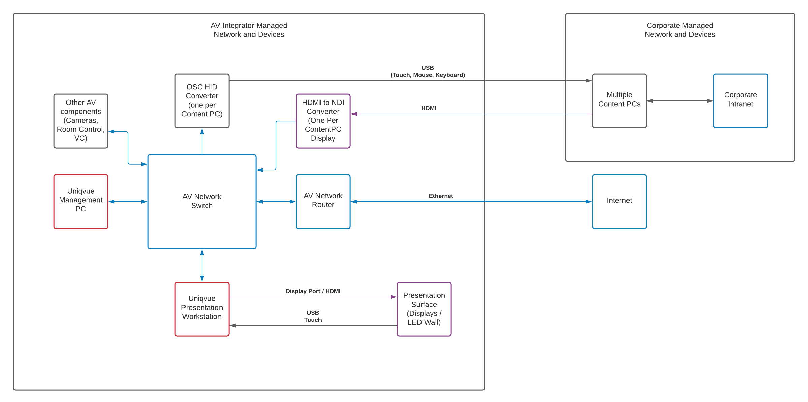
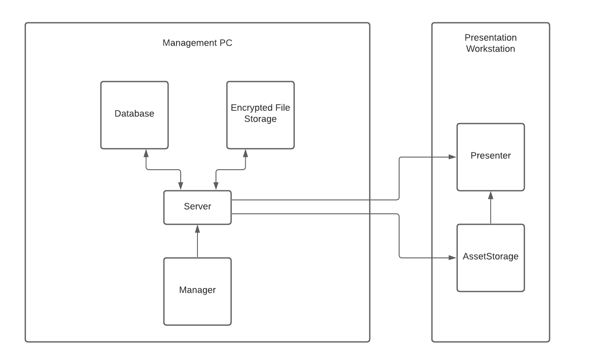

# Uniqvue Netzwerk und Hardwarekomponenten

**Uniqvue** besteht aus mindestens zwei PCs, die über ein Netzwerk verbunden sind. Einer leistungsstarken 3D-Workstation, die alle Inhalte anzeigt und die Shows im Showroom ausführt, und einem leistungsärmeren Verwaltungs-PC, auf dem die Inhalte vorbereitet und gespeichert werden. Technisch gesehen, kann die Verwaltungssoftware auch auf der 3D-Workstation laufen, es wird aus Gründen der Benutzerfreundlichkeit nicht empfohlen.

**Uniqvue** kann an eine Vielzahl von AV-Komponenten angeschlossen werden, je nach den Anforderungen der installierten Umgebung. Zum Beispiel Raumsteuerungssysteme (wie Crestron oder AMX), VC-Codecs (wie Polycom oder Cisco), DMX Beleuchtung (Art-Net, sACN), Audio DSPs (Dante, AVB, Analog). Eine Internetverbindung wird empfohlen, um Echtzeitdaten anzuzeigen, Videokonferenzen durchzuführen, Fernwartungszugriff zu ermöglichen usw.

Da diese AV-Komponenten und der Internetzugang im gesicherten Firmennetzwerk möglicherweise untersagt sind, kann Uniqvue völlig unabhängig in seinem eigenen Netzwerk installiert werden. Zur Anzeige von Inhalten, die nur innerhalb des Firmennetzwerks zugänglich sind, gibt es eine Anzeige- und Steuerungslösung, die keine Netzwerkverbindung des AV-Netzwerks mit dem Firmennetzwerk erfordert.

Dies wird mit zwei Komponenten erreicht:

- Der Displayausgang eines Firmen-PC (genannt "Content-PC") wird zu einem HDMI-zu-NDI-Konverter ausgespielt und als NDI-Netzwerk-Stream in das AV-Netzwerk weitergeleitet. Die Presenter Software auf der 3D-Workstation kann nun diesen Displayausgang als Bild im Bild darstellen.

- Um diesen Content-PC fernzusteuern, werden Tastatur- und Mauseingaben, die auf der 3D-Workstation auf das Bild im Bild erfolgen, an ein "HID Konverter"-Gerät weitergeleitet, das über USB mit dem Content-PC verbunden ist. Der HID-Konverter meldet sich beim Content-PC als Standard-HID-Gerät (Tastatur, Maus, Touchscreen) an. Da es sich bei HID um einen System-Standardtreiber handelt, ist keine zusätzliche Software zur Steuerung des Content-PCs erforderlich.

**Uniqvue** unterstützt die Anzeige und Steuerung mehrerer Displays pro PC und mehrerer PCs mit Auflösungen bis zu 3840x2160 Pixel.

# Hardware-Spezifikationen

**Präsentations-Workstation**

- **GPU:** Nvidia Quadro RTX 6000 oder besser

- **CPU:** Intel Core i9 9700k oder besser (maximale Single-Thread-Leistung)

- **RAM:** mindestens 32GB Dual-Channel

- **Speicher:** mindestens 512Gb SSD. Raid empfohlen. NVMe-Laufwerke empfohlen. Trennung von System- und Content-Laufwerk empfohlen.

- **Netzwerk:** mindestens 1Gbit/s, 10Gbit/s empfohlen

- **OS:** Windows 10 englisch oder deutsch

**Management PC**

- **GPU:**: Nvidia Quadro P400 oder besser

- **CPU:** intel Core i5 9. Generation oder besser

- **ARBEITSSPEICHER:** 16GB

- **Speicher:** mindestens 512Gb SSD. Raid empfohlen. NVMe-Laufwerke empfohlen. Trennung von System- und Content-Laufwerk empfohlen.

- **Netzwerk:** mindestens 1Gbit/s, 10Gbit/s empfohlen

- **OS:** Windows 10 englisch oder deutsch

# Uniqvue Presenter Beschränkungen

- 24,8 Megapixel maximale Auflösung (3x4k Display oder äquivalent), kombiniert zu einer Displaygruppe (Nvidia Mosaic)

- Maximal 4 Displayausgänge (bei Displaywänden können Wall Controller oder Splitter zum Einsatz kommen)

- 32 NDI-Eingänge (4 4k60Hz oder 16 FullHD60Hz Eingänge gleichzeitig)

# Uniqvue-Software-Komponenten

**Server**

Der Uniqvue Server ist die zentrale Verwaltungskomponente in Uniqvue. Er ist ein Windows-Dienst, der im Hintergrund läuft und auf den der Benutzer nicht direkt zugreifen kann. Der Server verwendet eine SQlite-Datenbank, um alle Konfigurationen zu speichern, und einen Dateisystemordner, um verschlüsselte Asset-Dateien zu speichern, die von Benutzern hinzugefügt wurden.

**Manager**

Der Uniqvue Manager ist eine Windows-Anwendung zur Vorbereitung von Shows und zur Verwaltung der mit dem Presenter angezeigten Inhalte. Uniqvue Manager läuft auf demselben Rechner wie Uniqvue Server.

**Asset-Storage**

Uniqvue AssetStorage ist eine System-Tray-Anwendung, die auf der 3D-Workstation läuft. Sie verbindet sich mit dem Server (TCP Port 5001) und kopiert automatisch alle freigegebenen Inhalte aus dem verschlüsselten Dateispeicher auf die 3D-Workstation und macht sie dem Presenter zugänglich.

**Presenter**

Der Uniqvue Presenter ist die Ausspielsoftware, die im Showroom zum Durchführen einer Show genutzt wird. Sie verbindet sich mit dem Server (TCP Port 5001), um die vorbereiteten Shows zu bekommen und anzuzeigen. Auf eingebettete Assets wird direkt über das Uniqvue AssetStorage zugegriffen.

# Verwendete Software-Umgebungen:

**Server:** C# ASP .Net 5, SQlite Datenbank

**Manager:** C# .NetCore 3.1 WPF

**Asset-Speicherung:** C# .NetCore 5

**Presenter:** Ventuz Runtime Enterprise 

