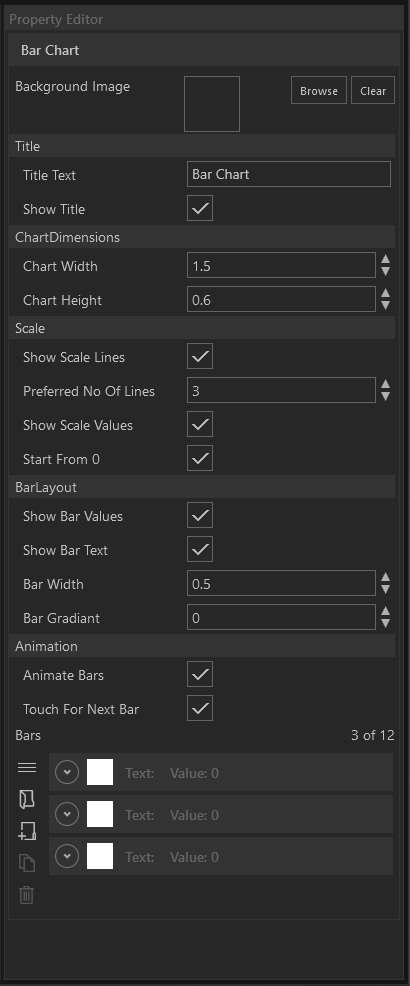

 

Das Bar Chart Module bietet die Möglichkeit animierte Balkendiagramme für ihre Show zu verwenden. Jeder Balken wird im Property Editor als Element in einer Liste repräsentiert. Jeder von maximal 12 Balken kann mit einem beliebigen Wert, einer Bezeichung und einer Farbe versehen werden.

        

<ul>
    <li>

         Neuen Listeneintrag am Ende erstellen
    
</li>
    <li>
 Neuen Listeneintrag duplizieren
</li>
    <li>
 Ausgewählten Listeneintrag löschen
</li>
</ul>

Folgende Attribute bestimmten die Darstellung und das Verhalten des Diagramms im Allgemeinen:

•    Title Text - Überschrift des Diagramms.

•    Show Title - Durch Setzen des Hakens wird die Überschrift angezeigt. 

•    Chart Width/Height - Hiermit lässt sich die Breite und Höhe des Diagramms justieren.

•    Show Scale Lines - An- und Abwählen der Wertemarkrierung für die Y-Achse.

•    Preferred No. Of Lines - Das ist ein Richtwert, der eine bevorzugte Anzahl Wertemarkierungen auf der Y-Achse bestimmt. Wenn möglich wird diese Anzahl der Wertemarkierung dargestellt. In manchen Situationen werden aber mehr, oder weniger angezeigt.

•    Show Scale Values - Durch Setzen des Hakens  werden die Zahlenwerte der Wertemarkierungen angezeigt.

•    Start From 0 - Durch Setzen des Hakens starten die Wertemarkierungen zwingend bei 0.

•    Show Bar Values - Durch Setzen des Hakens werden die Zahlenwerte der Balken dargestellt.

•    Show Bar Text - Durch Setzen des Hakens wird der Name des Balkens dargestellt.

•    Bar Width - Hiermit lässt sich Breite der Balken justieren.

•    Bar Gradient - Werte von 0-100 bestimmen die Farbabsenkung der Balken. Der Wert 0 bedeutet keine Farbabsenkung. Der Wert 100 führt zur maximalen Farbabsenkung. Dies ist als Gradient sichtbar. 

•    Animate Bars - Durch setzen des Hakens werden die Balken beim Öffnen des Moduls im Showroom animiert.

•    Touch For Next Bar - Ist der Haken gesetzt führt jede Weitere Berührung zur animierten Erscheinung eines weiteren Balkens. 

Informationen wie das Modul verwendet wird, finden Sie im Kapitel Showroom im Abschnitt Agenda/[Bar Chart](../../agendaalternate/#bar-chart).

