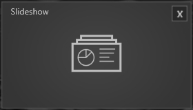

 

Bildsequenzen oder eine Sammlung von Bildern lassen sich mit diesem Modul einbinden. Durch Wischen lässt sich das nächste Bild anzeigen.

•    Folder Path - Öffnet den Asset Browser in dem ein Ordner, der mehrere Bilder enthält, ausgewählt werden kann. 

•    Show Navigation - Der gesetzte Haken zeigt die Navigation an 

•    Navigation Inside Frame – Ein gesetzter Haken zeigt die Navigation im Bild an. 

Informationen wie das Modul verwendet wird, finden Sie im Kapitel Showroom im Abschnitt Agenda/[Slideshow](/agendaalternate/#slideshow).
