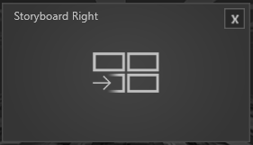

   

Dieses Modul kann aus bis zu 3 Fenstern bestehen. Das Center Fenster zeigt Slides an, die mit einer Wischgeste nach rechts und links bewegt werden können. Ein Slide welches so bewegt wurde sammelt sich entsprechend rechts oder links in einem Fenster, und ordnet sich in einem Gitter an. 

•    Slide Folder - Öffnet den Asset Browser, um einen Pfad zum Ordner mit den Slides auszuwählen. 

•    Storyboard Left - Je nach Setup und Platzierung ist der Haken gesetzt. Außerdem kann für dieses Fenster separat ein Background Image mit dem Asset Browser ausgewählt werden. 

•    Storyboard Right - Je nach Setup und Platzierung ist der Haken gesetzt. Außerdem kann für dieses Fenster separat ein Background Image mit dem Asset Browser ausgewählt werden. 

Informationen wie das Modul verwendet wird, finden Sie im Kapitel Showroom im Abschnitt Agenda/[Storyboard](/agenda/#storyboard).
