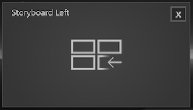

 

 

Dieses Modul kann aus bis zu 3 Fenstern bestehen. Das mittlere Fenster zeigt Slides an, die mit einer Wischgeste nach rechts und links bewegt werden können. Ein Slide welches so bewegt wurde sammelt sich entsprechend rechts oder links in einem Fenster, und ordnet sich in einem Gitter an.

Im Sessioneditor lassen sich Slides entweder einzeln oder gesammelt hinzufügen. Die zugewiesenen Slides werden im Property Editor als einzelne Listenelemente dargestellt. Die Reihenfolge der Elemente können via Drag and Drop verändert werden. Elemente können zudem gezielt dupliziert, gelöscht oder eingefügt werden.

        

<ul>
    <li>
 Asset Browser öffnen um mehrere Bild- oder Videodateien als neue Liste zu erstellen
 </li>
    <li>

         Neuen Listeneintrag am Ende erstellen
    
</li>
    <li>
 Neuen Listeneintrag duplizieren
</li>
    <li>
 Ausgewählten Listeneintrag löschen
</li>
</ul>

•    Background Image - Die gesamte Slideshow kann mit einem Hintergrund hinterlegt werden. Klicken auf 'Browse' öffnet den Asset Browser. 

•    Storyboard Left - Je nach Setup und Platzierung ist der Haken gesetzt. Außerdem kann für dieses Fenster separat ein Background Image mit dem Asset Browser ausgewählt werden. 

•    Storyboard Right - Je nach Setup und Platzierung ist der Haken gesetzt. Außerdem kann für dieses Fenster separat ein Background Image mit dem Asset Browser ausgewählt werden. 

Informationen wie das Modul verwendet wird, finden Sie im Kapitel Showroom im Abschnitt Agenda/ [Storyboard](../../agendaalternate/#storyboard).

