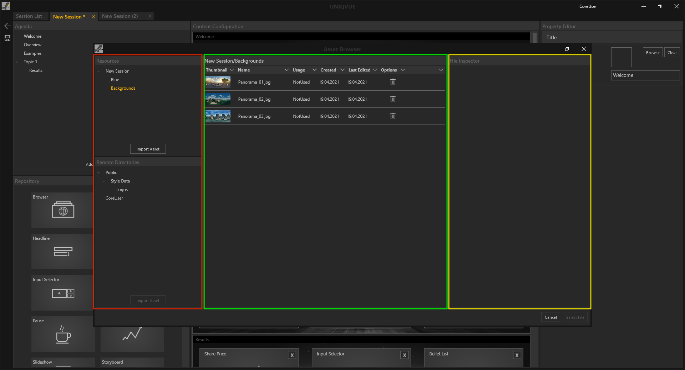

# Asset Browser

Der *Asset Browser* öffnet sich an allen Stellen im *Session Manager*, an denen man auf den Button mit der Beschriftung 'Browse' klickt. Der *Asset Browser* verhält sich konsistent und ist kontextbezogen. Das bedeutet zum einen, dass der *Asset Browser* automatisch nach entsprechenden Dateien filtert. Möchte man zum Beispiel ein Video im Modul 'Video' laden, so werden auch nur Videodateuen angezeigt. Entsprechend werden bspw. keine Bild- oder Audiodateien angezeigt. Zum anderen zeigt der *Asset Browser* an, wo er geöffnet wurde. Öffnet man ihn beim Bearbeiten einer *Toolbox*, so befindet sich der *Asset Browser* innerhalb dieses Projektes. Der Name der aktuellen Bearbeitungsebene (*Toolbox*, *Session*, *Style* oder *Team*) wird links in der Ordnerstruktur gehighlightet angezeigt. Alle Assets werden der jeweiligen *Session, Toolbox, Team Gallery oder Style* zugeordnet. Nutzt man ein Asset aus dem 'Public' oder 'User' Verzeichnis, so wird eine Referenz erzeugt. Auch wenn das Original später im 'Public' Verzeichnis gelöscht werden sollte, bleibt das zugewiesene Asset in einer *Session, Toolbox, Style* davon unberührt .

Zur besseren Übersicht sind die Bereiche oben farbig umrandet. Der *Asset Browser* ist wie folgt aufgebaut:
***

<ul>
<li>Links befindet sich die Ordnerstruktur. Diese ist vertikal zweigeteilt. Oben sieht man den Projektordner, in dem der Asset Browser geöffnet ist. Darunter sieht man die allgemeine Ordnerstruktur, die nach den eigenen Wünschen angepasst werden kann. Hier wählt man aus, wo die Datei gespeichert werden soll. Neue Ordner können hier angelegt werden, um eine eigene Struktur aufzubauen. 
</li>

<li>In der Mitte sieht man das Hauptfenster. Hier werden die Dateien des ausgewählten Ordners aufgelistet. 
</li>

<li>Im Inspektor Fenster auf der rechten Seite, werden aktuelle Attribute einer ausgewählten Datei angezeigt. Zusätzlich dazu wird eine Miniaturvorschau in Form eines Icons oder eines Thumbnails bereitgestellt. Bei Videos ist es zudem möglich über einen Slider eine Stelle des Videos als Thumbnail auszuwählen. 
</li>

</ul>
