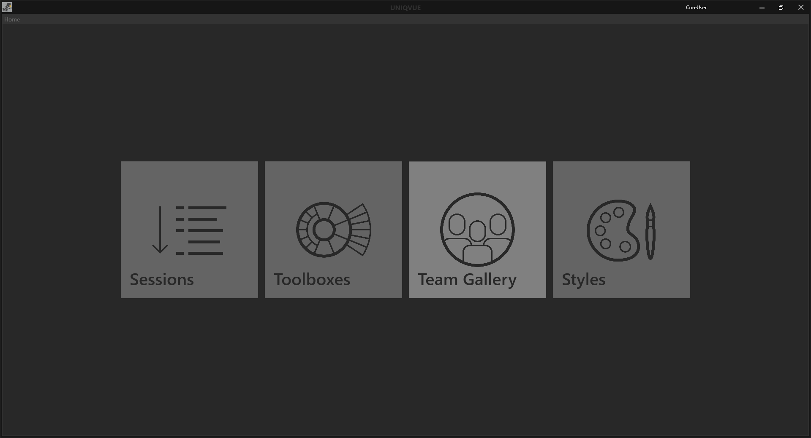

# Dashboard 

 

Das Dashboard ist in folgende Kategorien eingeteilt: 

## Session 

Eine *Session* beinhaltet alle Elemente und Bedienkonzepte die man für eine *Show* benötigt. In Kapitel [Session](sessions.md) gibt es einen Überblick und in Kapitel [Session Workflow](sessionworkflow.md) wird erläutert wie man damit arbeitet. 

***
## Toolboxes 

Eine *Toolbox* ist eine jederzeit aufrufbare Bedienmöglichkeit, um auf alle Ressourcen und Funktionen zugreifen zu können. In Kapitel [Toolboxes](toolbox.md) gibt es einen Überblick und in Kapitel [Toolbox Workflow](toolboxworkflow.md) wird erklärt wie [Toolboxes](toolbox.md) erstellt und konfiguriert werden können. 

***
## Team Gallery 

Darstellung des Teams mit nützlichen Informationen zum Team. Erstellen und Konfigurieren von verschiedenen Teams in der [Team Gallery](teamgallery.md). 

***
## Styles 

Erstellen und Konfigurieren des “Look and Feels” einer Session. In Kapitel [Session](sessions.md) gibt es einen Überblick und in Kapitel [Session Workflow](sessionworkflow.md) wird erklärt wie Sessions erstellt und konfiguriert werden können. 
