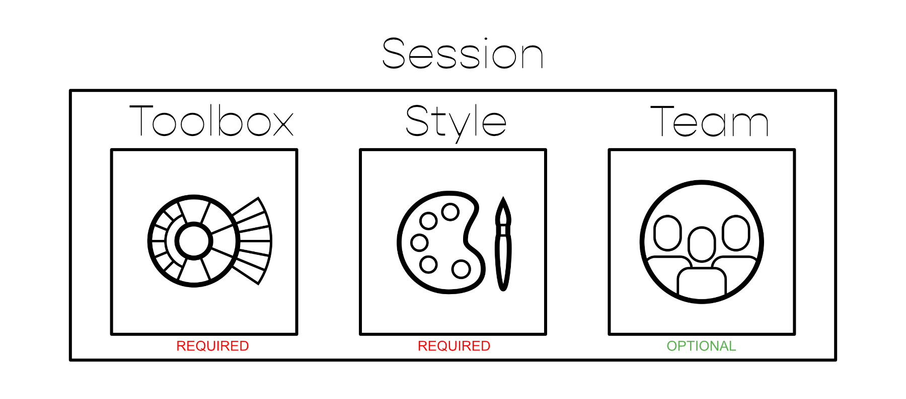

# Dashboard 

 

Ausgagspunkt für die gesamte Konfiguration der Funktionen in UNIQVUE ist der Manager. Nach dem Login gelangen Sie in das Dashboard. Hier zu sehen sind die Schaltflächen, welche weiter in die Bearbeitungsebenen der einzelnen großen "Bausteine" führen, aus denen sich eine Session zusammensetzt.

## Session 

 

Ganz grundsätzlich ist eine *Session* das Übergeordnete Objekt sozusagen der Ursprung, welches weitere Objekte, namentlich eine *Disc (Toolbox)*, einen *Style* und ein Team in sich beherbergt. Während es zwingend notwendig ist eine Disc und einen Style einer Session zuzuweisen, ist ein Team optional.
Eine *Session* beinhaltet alle Elemente und Bedienkonzepte die man für eine Präsentation im *Showroom* benötigt. In Kapitel [Session](sessions.md) gibt es einen Überblick und in Kapitel [Session Workflow](sessionworkflow.md) wird erläutert wie man damit arbeitet.

***
## Toolboxes 

Eine *Toolbox oder DISC* ist eine jederzeit aufrufbare Bedienmöglichkeit, um auf alle Ressourcen und Funktionen zugreifen zu können. In Kapitel [Toolboxes](toolbox.md) gibt es einen Überblick und in Kapitel [Toolbox Workflow](toolboxworkflow.md) wird erklärt wie [Toolboxes](toolbox.md) erstellt und konfiguriert werden können. 

***
## Team Gallery 

Darstellung des Teams mit nützlichen Informationen zum Team und den Team Membern. Erstellen und Konfigurieren von verschiedenen Teams in der [Team Gallery](teamgallery.md). 

***
## Styles 

Erstellen und Konfigurieren des “Look and Feels” einer Session. In Kapitel [Styles](styles.md) gibt es einen Überblick und in Kapitel [Style Workflow](styleworkflow.md) wird erklärt wie Sessions erstellt und konfiguriert werden können. 
