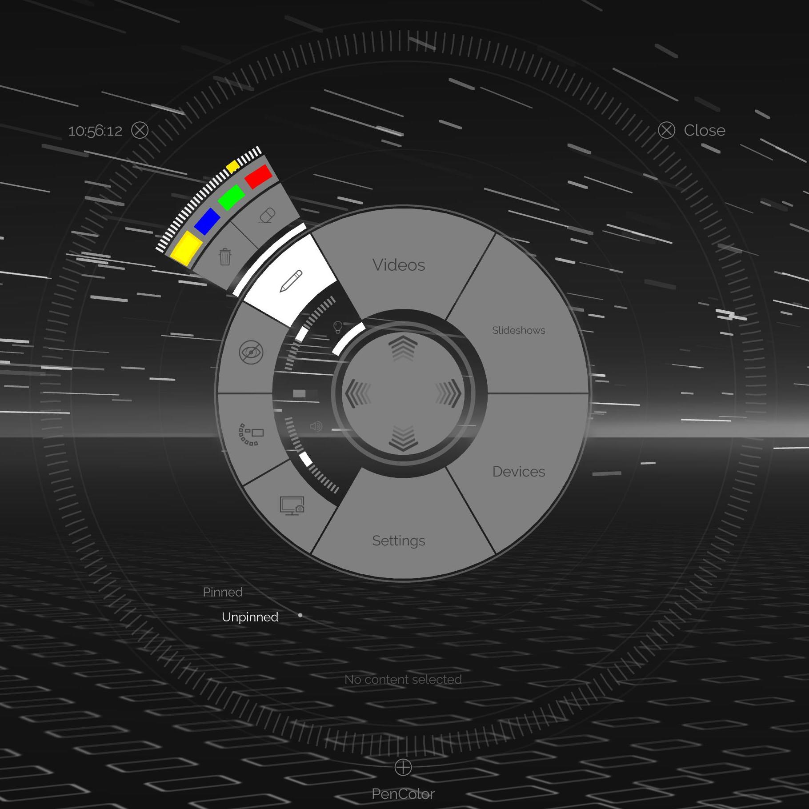
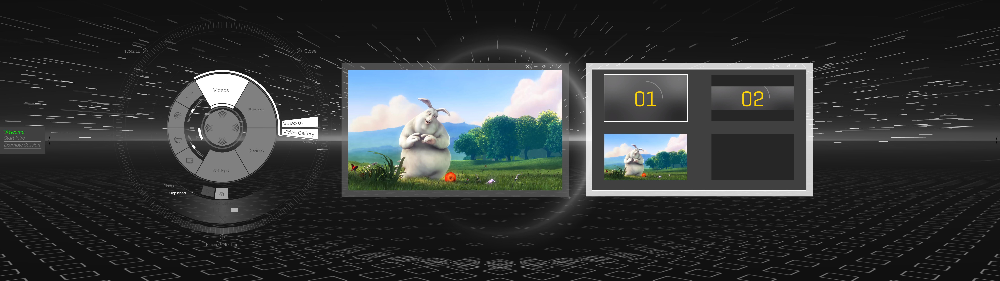
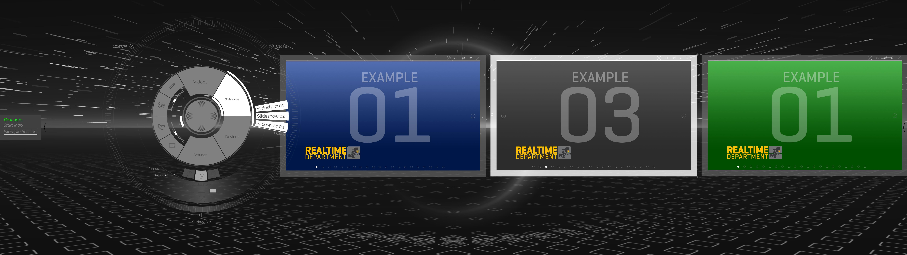
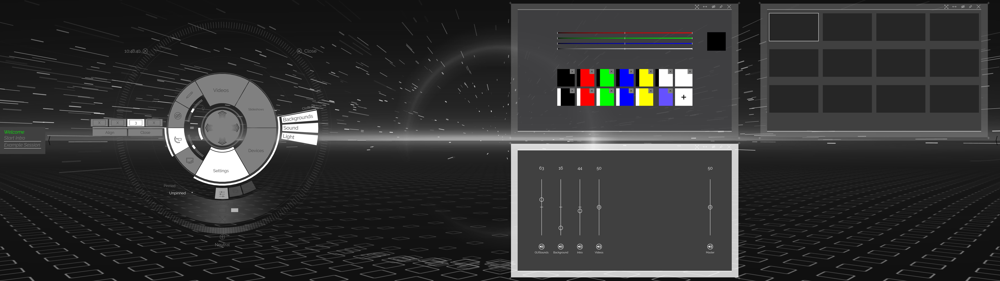
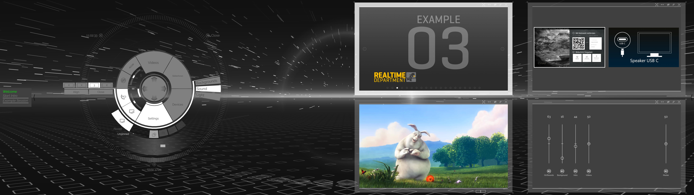
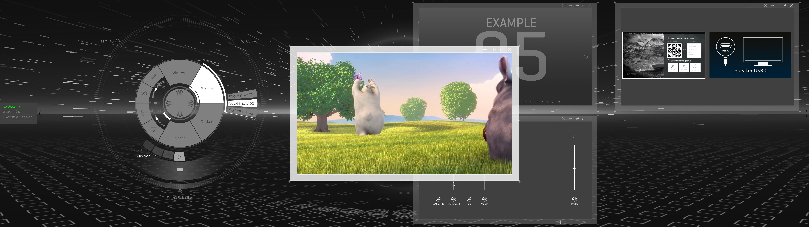
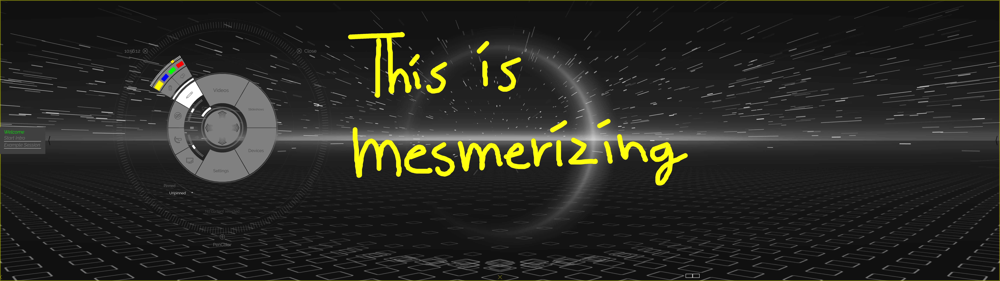
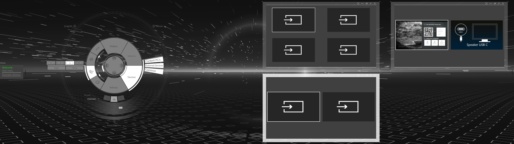
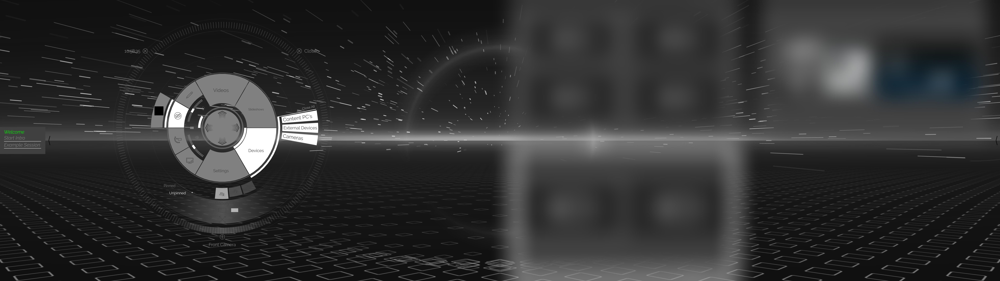
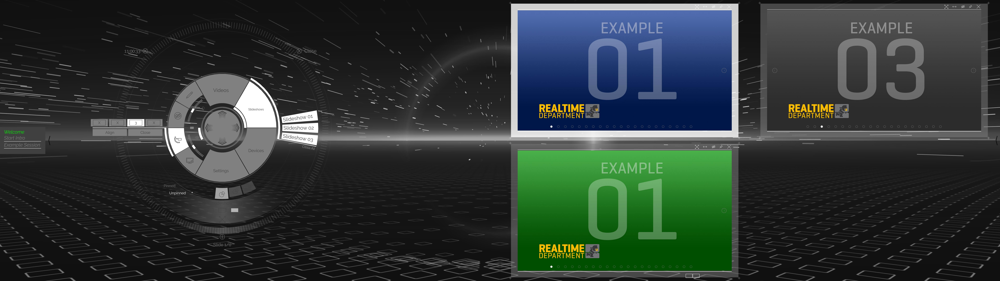

# Disc (Toolbox)

Die Disc ist neben den direkt Toucheingaben auf die entsprechenden Schaltflächen das zentrale Bedienelement. Es ermöglicht Ihnen eine schnelle und einfache Navigation und die Kontrolle über den gesamten Showroom. Die Disc ist in ihrem Funktionsumfang managerseitig auf ihre Wünsche und ihren Workflow anpassbar. Neben den Standardtools, die für die Kontrolle des Systems wie z.B Audio Volumen und dem Managment von Inhalten zuständig sind, ist auch der direkte Zugriff auf Module unabhängig der Agenda möglich. In Kapitel [Toolbox](toolboxes.md) und [Toolbox Workflow](toolboxworkflow.md) wird dies im Detail erläutert. In jeder Phase des Showrooms, unabhängig davon ob eine Session geladen ist, ist die Disc "griffbereit". Durch ein längeres Berühren auf der Touchfläche kommt die Disc zum Vorschein oder lässt sich von einer anderen Stelle auf dem Display herholen. Im Folgenden werden die einzelnen Funktionen der Disc mit Beispielen detailliert erläutert.
***
Das Bild zeigt die Disc mit dem aktiven Stiftwerkzeug. Damit können sie frei auf dem gesamten Displaybereich zeichnen. Wie sich erahnen lässt, können Sie aus einer Farbpalette auswählen und über den Slider die Größe des Stifts (Brushsize) einstellen. Mit dem Mülltonnensymbol kann das gezeichnete mit einer Berührung wieder gelöscht werden. Das Radiergummisymbol daneben löscht nur den berührten Bereich. 

***

***

***

***

***

***

***

***

***

