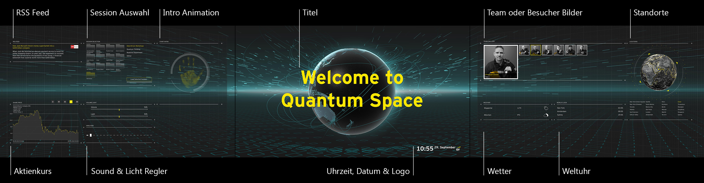
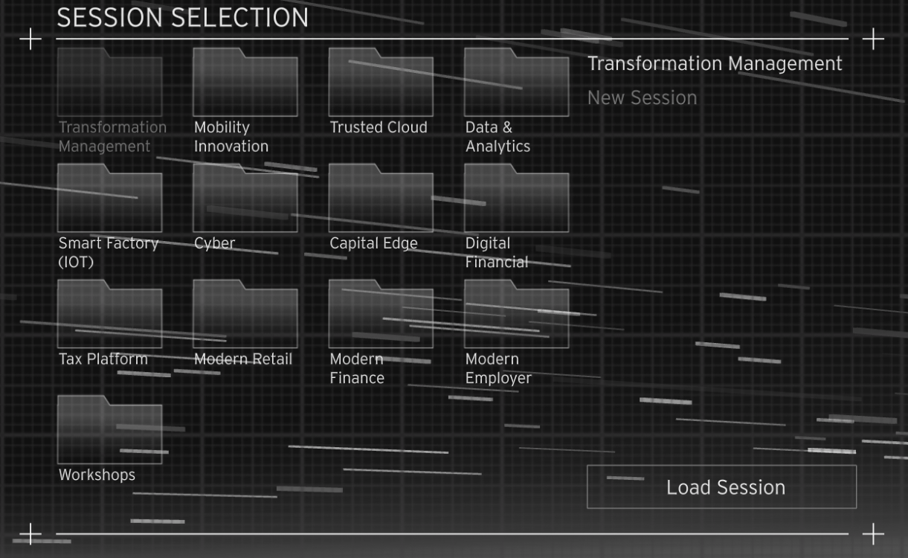
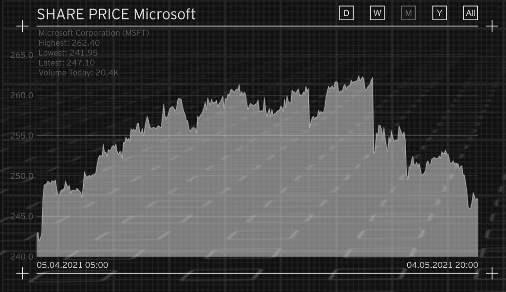
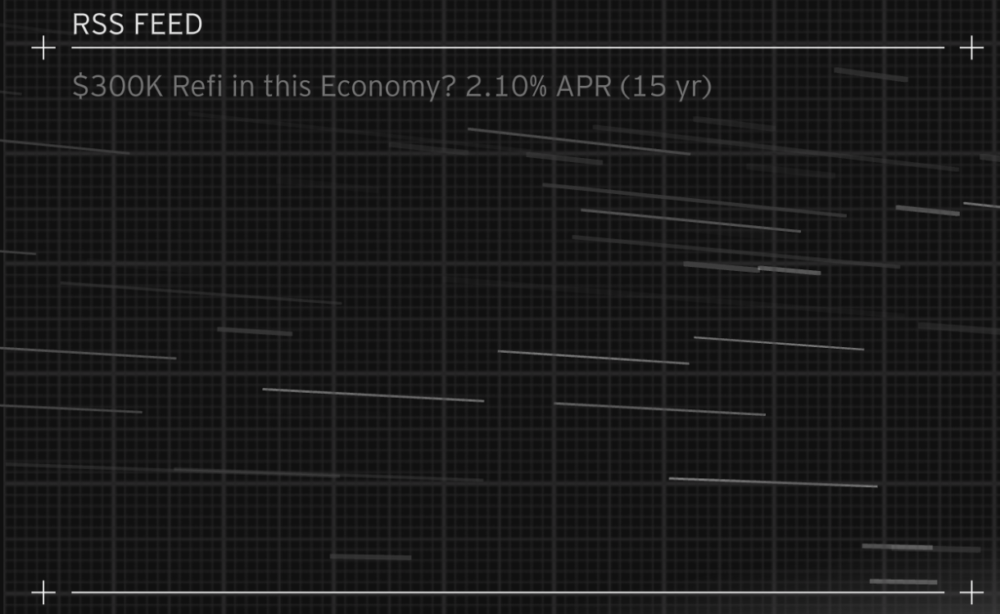
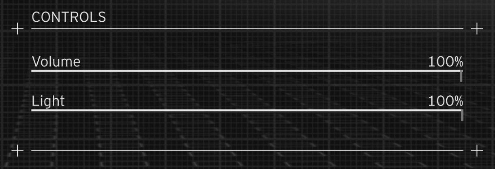
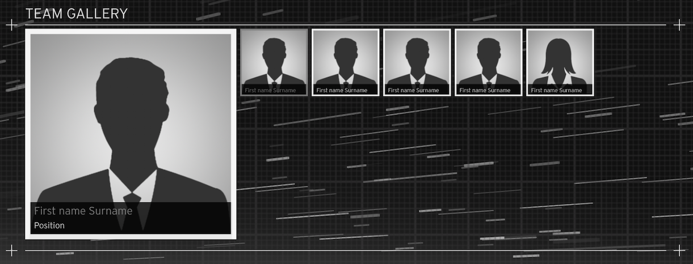
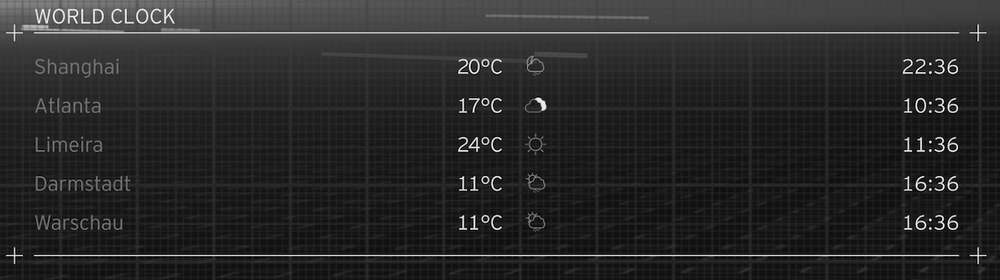

# Home Screen (Dashboard)

Der Home Screen (Dashboard) bildet den Ausgangspunkt einer jeden Session. Dieser besteht aus der Agenda und mehreren grafischen Elementen, die sog. Widgets. Die Widgets sind individuell angepasst. Im Folgenden sind die Standard-Widgets aufgelistet. 
***

* **Session Selection:** 

    Dieses Widget ist das Wichtigste, es zeigt eine Ordnerstruktur in denen Sessions organisiert sind. Sessions die sie zuvor im Manager angelegt und freigegeben haben stehen Ihnen hier zur Verfügung. In Kapitel [Sessions](sessions.md) und [Session Worklfow](sessionworkflow.md) finden Sie eine detaillierte Erklärung, wie diese angelegt werden. Betätigen der Schaltfläche 'Load Session' lädt die ausgewählte Session, dabei zeigt ein Ladebalken den aktuellen Ladestatus an. Nach einem kurzen Moment ist die Session dann bereit gestartet zu werden.
    
    

***
* **Start Intro:**

    Durch längeres berühren der Fläche umschließt ein Ring die Hand. Ist der Ring vollständig, startet eine 3D Animation auf der gesamten Displayfläche. Die Animation ist die Überleitung von dem Homescreen hinein in eine Session. Dies ist ein eindrucksvoller Weg eine Präsentation zu starten. Die Startanimation ist optional. Sie können auch über die Agenda direkt in eine Session navigieren und die Startanimation überspringen.
  

  <video width="99%" height=920" autoplay loop muted markdown="1"> 
        <source src="../img/Showroom/Start_Intro.webm" type="video/webm" markdown="1">
   </video>
   

    
***
* **Share Price**

   
    Dieses Widget zeigt Ihnen den Börsenindex eines Unternehmens.
    

***
* **RSS Feed**

    Dieses Widget bindet einen RSS-Feed in ihren Homscreen ein.
    
    
    
***    
* **Controls**

    Hiermit können Sie Volumen und Helligkeit des Showrooms steuern.
    
    

***

* **Team Gallery**

    Dieses Widget zeig Ihnen das ausgewählte Team Ihrer geladenen Session an.
    
    

***

* **World Clock**

    Das World Clock Widget zeigt Ihnen die unterschiedlichen Zeiten auf der Erde.
    
    
    
***

* **Locations**

    Das Locations Widget visualisiert auf die Standorte Ihres Unternehmens. Durch Klicken auf einen Namen in der Liste, wird die entsprechende Stelle auf dem Globus fokussiert.
    
    

* **Agenda:**

    Am rechten und linken Rand Ihres Displaysetups befindet sich die Agenda, welche ausgefahren werden kann. Hierüber lässt sich zum einen direkt in die Session springen oder zuerst eine Startanimation abspielen. Darüber hinaus ist die Agenda das zentrale Werkzeug zum Navigieren durch Ihre Präsentation. In Kapitel [Agenda](agenda.md) wird dies genauer erläutert.

<video width="99%" height=220" autoplay loop muted markdown="1"> 
      <source src="../img/Showroom/Agenda_Start_Session_Small.webm" type="video/webm" markdown="1">
 </video>
 

 

<video width="99%" height=220" autoplay loop muted markdown="1"> 
       <source src="../img/Showroom/Agenda_Start_Intro_Small.webm" type="video/webm" markdown="1">
</video>

