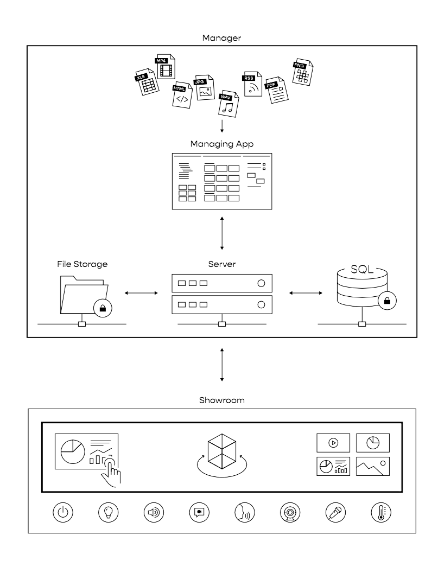

# UNIQVUE User Manual  

## Einleitung 

**UNIQVUE** ist ein  interaktives Framework für *Showrooms* und *Experience Center*. Es ermöglicht die dynamische Bespielung großer interaktiver Displayflächen in Echtzeit. Über den *Manager* können Inhalte und Quellen flexibel zu Showabläufen zusammengestellt werden. Zur Vereinfachung ist das System in diesem Manual in zwei Teile unterteilt, den **Manager** und den **Showroom**.  

## System Übersicht

**Manager:** 

Im Detail besteht der [Manager](sessionmanager.md) aus einer App (Benutzeroberfläche), einem Server, einem Filesystem und einer Datenbank. Für sie als User wird aber immer nur die App sichtbar sein. Geben sie Ihrer Show ein einnehmendes und besonderes Narrativ. Sie können bspw. die Raumsteuerung unter ihre Kontrolle bringen oder während einer Show mit ihrer speziell zusammengestellten Toolbox dynamisch auf besondere Situationen reagieren. 
***
**Managing App:** 

Hier verwalten Sie Ihre Showabläufe, Inhalte und Quellen. Sie legen Ihren Syle fest und befüllen die Toolbox mit Inhalten.  
***
**Server:**

Der Server läuft im Hintergrund und stellt die Kommunikation und den Transport der Daten zwischen den einzelnen Komponenten von UNIQVUE sicher.  
***
**File Storage:**

Hier werden die Inhalte verschlüsselt abgelegt. Jede Datei wird dazu in UNIQVUE „hochgeladen“. Dabei prüft das System, ob es die Datei bereits gibt. Falls ja, wird nur eine Referenz erstellt. 
***
**Datenbank:**

Alle Abläufe und Strukturen werden in einer Datenbank abgelegt. 
***
**Showroom:** 

Der [Showroom](showroom.md) ist die Bühne auf der alle Inhalte zusammenkommen und in hoher Auflösung und vielen Bildern pro Sekunde dargestellt werden. Hier bieten sich nochmal zahlreiche Möglichkeiten Einfluss auf die Show zu nehmen. UNIQVUE basiert auf einer 3D Echtzeit Rendering Engine ähnlich einer 3D Spiele Engine, aber mit dem Fokus auf Präsentation. Alles was Sie sehen wird in Echtzeit berechnet und dargestellt. Dadurch ist das System Auflösungsunabhängig, interaktiv und es kann auf Änderungen von Parametern sofort reagieren. Skalierbar und Datadriven wie man heute sagt. Ihnen stehen grundsätzlich zwei verschiedenen Wege bereit Ihrer Inhalte dem Publikum zu präsentieren. Sie können den Ablauf in Form einer Session vorab definieren sich durch eine Agenda navigieren, oder Sie legen die Inhalte nach Themen oder Typen sortiert in einer Toolbox an und können sie jederzeit flexible aufrufen. Beide Möglichkeiten können natürlich auch kombiniert warden.  
***
**Remote Client:**

Eine Besonderheit an UNIQVUE ist, dass wir externe PC’s als Quellen einbinden und diese fernsteuern können. Dies geschieht über einen HID Emulator. Es wird also keine Netzwerkverbindung zu diesem PC benötigt.  
***
**External Devices:**  

Neben den PC’S können auch Kameras und andere Quellen wie z.B. Apple TV, Clickshare oder Cynap eingebunden werden. 
***
**Raumsteuerung:**

Ein Showroom lebt von den kleinen Extras. Mit UNIQVUE können wir Ihre Raumsteuerung einbinden. Egal ob Licht, Ton, Jalousien, Sprachsteuerung, ob Crestron, DMX oder KNX. Wir verbinden alle Komponenten.  
***
**Webcasting & Streaming:**

Alle Bildquellen liegen in UNIQVUE als Videostreams im Netzwerk. Dadurch kann ein zusätzlicher Regieplatz eingerichtet und als Schlüsselposition für Hybrid Sessions genutzt werden. 
***
Dieses Manual soll den Umgang mit diesem System auf Anwenderebene zeigen. Im Detail wird erläutert, wie sie Shows im Session Manager nach ihren Vorstellungen erschaffen und im Showroom kontrollieren können. 
