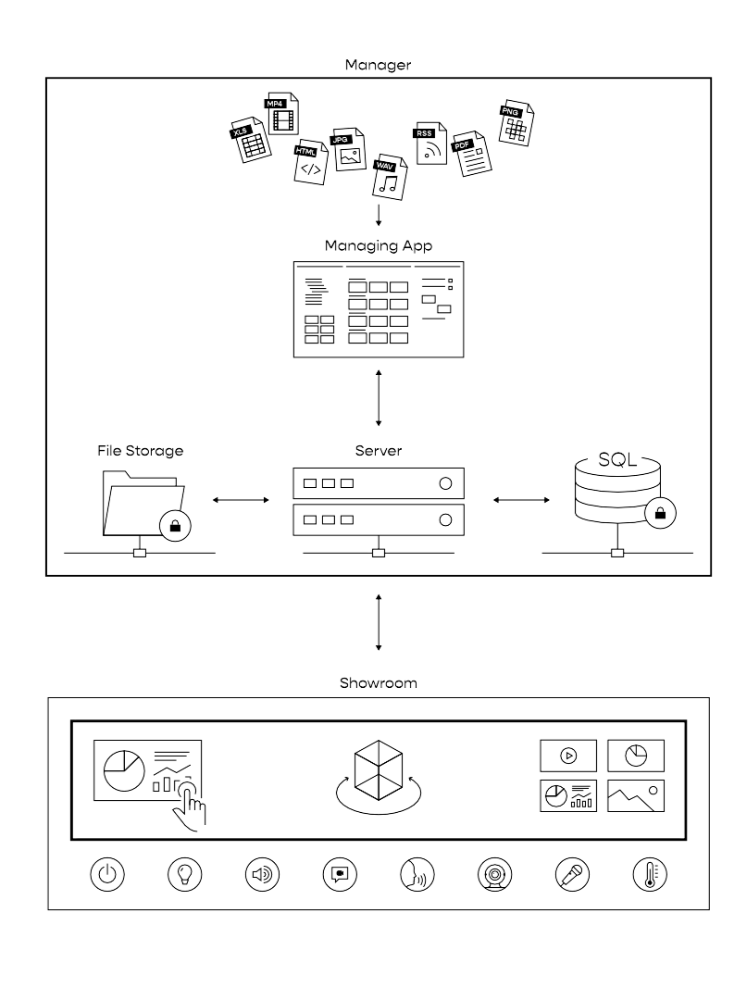

# UNIQVUE User Manual  

Dieses Manual erläutert den Umgang mit **UNIQVUE** auf Anwenderebene. 

<!-- Im Detail wird erläutert, wie Sie Shows im Session Manager, der Managing-App nach ihren Vorstellungen erschaffen und im Showroom kontrollieren können.  -->

## Einleitung 

**UNIQVUE** ist ein  interaktives Framework für *Showrooms* und *Experience Center*. Es ermöglicht die dynamische Bespielung großer interaktiver Displayflächen in Echtzeit. Über ein Authoringtool (*Manager*) können Inhalte und Quellen flexibel zu Showabläufen zusammengestellt werden. Das System ist in zwei funktionelle Bereiche eingeteilt:

- **Manager**
- **Showroom**  
***
## System Übersicht

***
## Manager 

Der Bereich des Managers besteht im Detail aus einer App bzw. Benutzeroberfläche, einem Server, einem Filesystem und einer Datenbank. 

**Manager App:** 

Über die Manager App ([UNIQVUE Manager](002_uniqvuemanager.md)) erstellen Sie Shows, verknüpfen Sessions, Styles und Toolboxes, kreieren Abläufe, verwalten Inhalte und stellen diese für die Ausspielung im Showroom bereit - Sie verleihen Ihrem Showroom mit einer Show ein einnehmendes und besonderes Narrativ. Sie können bspw. die Raumsteuerung unter Ihre Kontrolle bringen oder während einer Show mit Ihrer speziell zusammengestellten Toolbox dynamisch auf besondere Situationen reagieren.

**Server:**

Der Server läuft im Hintergrund und stellt die Kommunikation und den Transport der Daten zwischen den einzelnen Komponenten von UNIQVUE sicher.  

**File Storage:**

Hier werden die Inhalte verschlüsselt abgelegt. Jede Datei wird dazu in UNIQVUE „hochgeladen“. Dabei prüft das System, ob es die Datei bereits gibt. Falls ja, wird nur eine Referenz erstellt. 

**Datenbank:**

Alle Abläufe und Strukturen werden in einer Datenbank abgelegt. 
***
##Showroom 

Der [Showroom](054_showroom.md) ist die Bühne auf der alle Inhalte zusammenkommen und mit hoher Zeit- und Bildauflösung dargestellt werden. Hier bieten sich zahlreiche Möglichkeiten in Echtzeit Einfluss auf eine Show zu nehmen. UNIQVUE basiert auf einer 3D-Echtzeit-Rendering-Engine ähnlich einer 3D-Spiel-Engine, aber mit dem Fokus auf dynamische Präsentationen. Alles was Sie sehen wird in Echtzeit berechnet und dargestellt! Dadurch ist das System auflösungsunabhängig, interaktiv und es kann auf Änderungen von Parametern sofort reagieren. Dies macht UNIQVUE skalierbar und erlaubt das Einbinden von datengetriebenen oder "datadriven" Inhalten. Grundsätzlich stehen zwei verschiedene Wege bereit Ihre Inhalte dem Publikum zu präsentieren. Sie können den Ablauf in Form einer Session vorab definieren, sich durch eine Agenda navigieren oder Sie legen die Inhalte nach Themen oder Typen sortiert in einer Toolbox an und können sie jederzeit flexibel aufrufen. Beide Möglichkeiten können natürlich auch kombiniert werden.
***

##Besondere Features

**Remote Client:**

Eine Besonderheit an UNIQVUE ist, dass Sie externe PC’s als Quellen einbinden und fernsteuern können. Dies geschieht über einen HID-Emulator - Hiermit wird keine IP-basierte Netzwerkverbindung zum externen PC benötigt.  
***
**External Devices:**  

Neben den PC’S können auch Kameras und andere Quellen wie z.B. Apple TV, Clickshare oder Cynap eingebunden werden. 
***
**Raumsteuerung:**

Ein Showroom lebt von den kleinen Extras. Mit UNIQVUE können wir Ihre Raumsteuerung einbinden. Egal ob Licht, Ton, Jalousien, Sprachsteuerung, ob Crestron, DMX oder KNX. Wir verbinden alle Komponenten.  
***
**Webcasting & Streaming:**

Alle Bildquellen liegen in UNIQVUE als Videostreams im Netzwerk. Dadurch kann ein zusätzlicher Regieplatz eingerichtet und als Schlüsselposition für hybride Sessions genutzt werden. 

