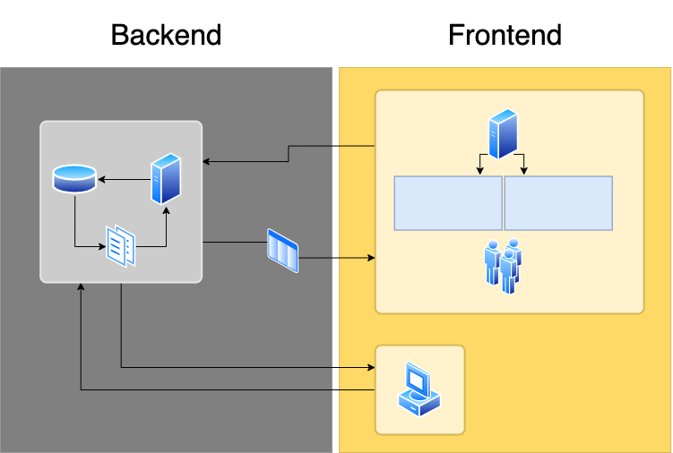

# UNIQVUE User Manual  

## Einleitung 

Das Manual ist in 3 Bereiche eingeteilt. 

* Im ersten Teil werden alle Elemente und Fenster des [Session Managers](sessionmanager.md) erklärt. Die System Übersicht erläutert das Zusammenwirken der einzelnen Komponenten.

* In Teil zwei beschäftigt sich mit den Workflows des *Session Managers*. Die Workflows ermöglichen dem Anwender die umfassende Bedienung der Applikation, um eine komplette Show zu erstellen.

* Der dritte Teil setzt sich mit dem [Showroom](showroom.md) auseinander und wie dieser zielführend benutzt wird.
</li>

Wichtig ist, dass sie das gelesene anwenden und ausprobieren! Nur so festigt sich ihr Wissen und sie werden spielend ein Experte im Umgang mit der Anwendung. 
***

## System Übersicht 

 

Um grundsätzlich das gesamte System zu verstehen wird anhand des Diagramms durch die einzelnen Komponenten geführt und diese erläutert. 

Das ganze System kann in 2 Bereiche unterteilt gesehen werden, welche verschiedene Aufgaben übernehmen. Das sogenannte *Backend* organisiert und strukturiert im Hintergrund Dateien und stellt diese bereit, während das sog. *Frontend* die Schnittstelle zum Anwender bildet. Zum *Frontend* zählt also gewissermaßen der *Showroom* mit seiner grafischen Oberfläche als auch die *Session Manager Anwendung*. 

Unter genauerer Betrachtung ist das Backend wiederum in 3 Bereiche unterteilt: 
<ul>
<li>Server
</li> 

<li>Dateiensystem
</li> 

<li>SQL-Datenbank
</li>
</ul>

Der Server übernimmt den Transport der Daten zwischen *Frontend* und *Backend*. 

Das Dateiensystem ist die nächsttiefere Ebene. Hier werden alle Dateien, die in *Sessions* eingebunden werden sollen, strukturiert. 

Die SQL-Datenbank ist die niedrigste Ebene in diesem System und ist für die widerspruchsfreie, dauerhafte Speicherung aller Dateien zuständig. 

Das *Frontend* ist im weitesten Sinne die Konfiguration und Darstellung. Über den Server sind die Daten aus dem Backend abrufbar. Mit der *Session Manager* Anwendung als Authoring-Tool können Präsentationen als aufwendige Shows angelegt werden. Geben sie ihrer Show ein einnehmendes und besonderes Narrativ. Sie können bspw. die Raumsteuerung unter ihre Kontrolle bringen oder während einer Show mit ihrer speziell zusammengestellten Toolbox dynamisch auf besondere Situationen reagieren. 

Im *Showroom* kommen letztlich alle Daten zusammen und werden zum Leben erweckt. Mit Hilfe einer starken 3D-Engine wird ihre zuvor erstellte Show visuell hochwertig und ansprechend dargestellt. Hier bieten sich nochmal zahlreiche Möglichkeiten Einfluss auf die Show zu nehmen. 

Dieses Manual soll den Umgang mit diesem System auf Anwenderebene zeigen. Im Detail wird erläutert, wie sie Shows im *Session Manager* nach ihren Vorstellungen erschaffen und im *Showroom* kontrollieren können. 
