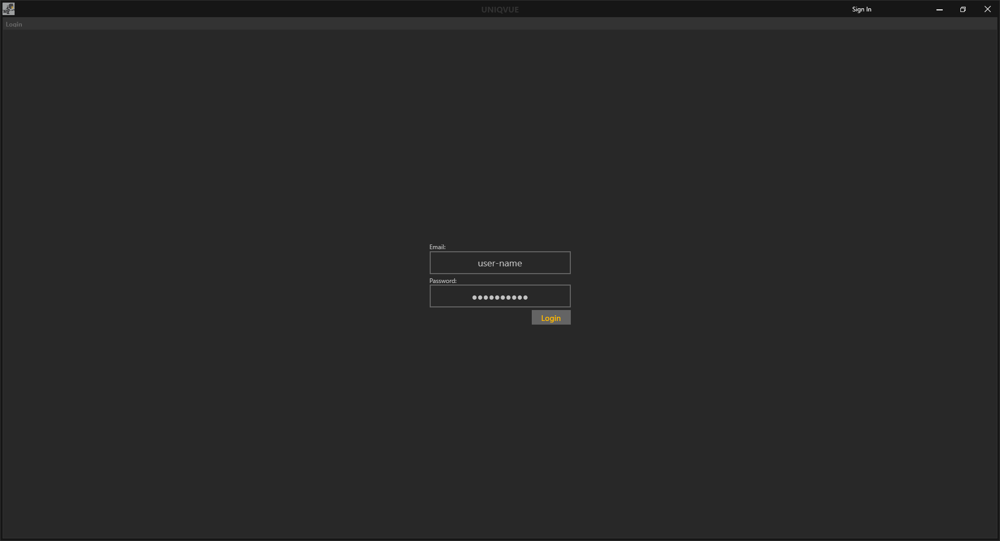

# Login

Nachdem dem Starten der Managing App *Session Manager* gelangen sie in dem Anmeldebereich.

Geben sie Ihren Benutzernamen und das dazugehörige Passwort in die Felder ein um sich im [Session Manager](sessionmanager.md) von UNIQVUE einzuloggen.
