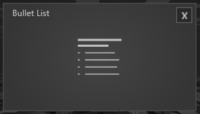
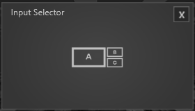

# Module

 

*Module* treten an verschiedenen Stellen im *Session Manager* auf. Der *Session Editor* hält alle Module bereit, um eine *Agenda* zu gestalten. Der *Toolbox Editor* enthält zusätzlich zu den Modulen, die auch im *Session Editor* existieren, weitere spezielle Module, die nur über die Toolbox erreichbar sind. In Kapitel **Toolbox** wird darauf detailliert eingegangen. 

Hier ist eine Übersicht der Module aus der Session und wie sie funktionieren. 

***

## Singleview Module 

Diese Module können je nach Display Setup an eine Position gezogen werden und erscheinen später im Showroom auf dem entsprechenden Display. 

Alle Singleview Module haben konsistente, allgemeine Eigenschaften, die hier aufgelistet sind. 

**Background Image:** Über den *Asset Browser* wird hier ein Hintergrundbild für dieses Modul geladen. Das Bild belegt dann das Display bzw. den gesamten Bereich in dem das Modul platziert wurde. 

**Size:** Hier wird die Größe der Darstellung des Fensters angegeben. Der Standardwert ist 0.75. Der Wert 1 entspricht Fullsize. 

**Title:** Titelvergabe eines Moduls. 

**Showtitle:** Durch Setzen des Hakens wird dieser Titel auch im Showroom angezeigt.  

Alle folgenden Module sind Singleview Module. Ihre individuellen Eigenschaften sind zudem aufgelistet. 
***

## Browser Modul

 

Das Browser Modul bindet Chrome als vollwertigen Browser in ihre Präsentation ein.

•    Show Header - Der gesetzte Haken zeigt die URL-Leiste, Bookmarks etc. an. 

•    URL - Hier kann man die Start URL eintragen, mit der das Browsermodul starten soll, z.B. https://www.google.de 

•    Bookmarks 01 - 05 - Hier stehen 5 Bookmarks zur Verfügung, denen man auch URLs vergeben kann, diese werden als kleine Icons generiert und oben rechts im Browserfenster angezeigt und dienen der direkten Wahl. 

Informationen wie das Modul verwendet wird, finden Sie im Kapitel Showroom im Abschnitt Agenda/[Browser](agenda.md#browser).

***
<!--- ## HTML Modul

 

Das HTML-Modul ist dazu da eben solche Inhalte im Showroom anzuzeigen. 

•    HTML Datei - Über den Asset Browser lässt sich eine HTML-Datei vergeben, welche im Showroom angezeigt wird.  

•    Transparancy - Der gesetzte Haken schaltet den Hintergrund Transparent. 

Informationen wie das Modul verwendet wird, finden Sie im Kapitel Showroom im Abschnitt Agenda/[HTML](agenda.md#html).
--->

***
## Bullet List Modul

 

Listen Sie wichtige Punkte in einer Bullet List auf.

•    Title - Hier kann der Titel für die Bullet List vergeben werden. 

•    Bullet - In einem internen Texteditor können Bullet Points erzeugt werden. 

Informationen wie das Modul verwendet wird, finden Sie im Kapitel Showroom im Abschnitt Agenda/[Bullet List](agenda.md#bullet-list).

***

## Title Modul

 

Führen Sie in ein Thema mit einer Überschrift, dem Title Modul ein oder heißen Sie die Teilnehmer der Session Willkommen.

•    Title - Über den internen Texteditor kann ein Titel geschrieben werden. 

Informationen wie das Modul verwendet wird, finden Sie im Kapitel Showroom im Abschnitt Agenda/[Title](agenda.md#title).

***
## Pause Modul

 

Strukturieren Sie die Pausen in ihrer Präsentation mit diesem Modul.

•    Titel - Über den internen Texteditor kann ein Titel vergeben werden. 

•    Bullet -  Über den internen Texteditor können Bullet Points erzeugt werden. 

•    Timer – Im Timer wird die Länge der Pause festgelegt.  

Informationen wie das Modul verwendet wird, finden Sie im Kapitel Showroom im Abschnitt Agenda/[Pause](agenda.md#pause).

***

## Videoplayer Modul

 

Binden sie Videos in ihre Präsentation ein, mit diesem Modul.

•    Video File - Öffnet den Asset Browser, um ein Video auszuwählen. 

•    Autostart - Ist der Haken gesetzt startet das Video automatisch. 

•    Repeat Video - Ist der Haken gesetzt läuft das Video in Schleife. 

Informationen wie das Modul verwendet wird, finden Sie im Kapitel Showroom im Abschnitt Agenda/[Videoplayer](agenda.md#videoplayer).

***
## Share Price Modul

 

Aktuelle Werte eines Unternehmens an der Börse können Sie mit diesem Modul in ihre Präsentation aufnehmen.

•    Share Price Symbol – Durch Eingeben der WKN-Nummer eines Unternehmens wird der Share Price angezeigt. 

An dieser Stelle sei erwähnt das maximal 5 Abfragen pro Minute und 500 Abfragen pro Tag gemacht werden können. 
Informationen über die erweiterte Nutzung dieses Services gibt es auf Anfrage. 

Informationen wie das Modul verwendet wird, finden Sie im Kapitel Showroom im Abschnitt Agenda/[Share Price](agenda.md#share-price).

***
## Slide Show Modul

 

Bildsequenzen oder eine Sammlung von Bildern lassen sich mit diesem Modul einbinden. Durch Wischen lässt sich das nächste Bild anzeigen.

•    Folder Path - Öffnet den Asset Browser in dem ein Ordner, der mehrere Bilder enthält, ausgewählt werden kann. 

•    Show Navigation - Der gesetzte Haken zeigt die Navigation an 

•    Navigation Inside Frame – Ein gesetzter Haken zeigt die Navigation im Bild an. 

Informationen wie das Modul verwendet wird, finden Sie im Kapitel Showroom im Abschnitt Agenda/[Slideshow](agenda.md#slideshow).

***
## External Source Modul

 

Mit diesem Modul können sie eine externe Quelle in ihre Präsentation übertragen..

•    External Source - Über das Dropdownmenü können verfügbare Quellen ausgewählt werden. 

Informationen wie das Modul verwendet wird, finden Sie im Kapitel Showroom im Abschnitt Agenda/[External Source](agenda.md#external-source).

***
## Multiview Module

Je nach Setup des Showrooms verhalten sich die Multiview Module anders. Das wirkt sich hauptsächlich auf die Anordnung der Fenster aus und wird angezeigt, sobald das Modul in der Session per Drag and Drop platziert wird. Zudem wird in den Eigenschaften angezeigt welche Platzierungen mit Ihrem Showroom-Setup möglich sind. Grundsätzlich gilt: Multiview Module haben mehr als ein Fenster und halten dadurch zusätzliche Funktionen bereit. 

***
## Storyboard Modul

   

Dieses Modul kann aus bis zu 3 Fenstern bestehen. Das Center Fenster zeigt Slides an, die mit einer Wischgeste nach rechts und links bewegt werden können. Ein Slide welches so bewegt wurde sammelt sich entsprechend rechts oder links in einem Fenster, und ordnet sich in einem Gitter an. 

•    Slide Folder - Öffnet den Asset Browser, um einen Pfad zum Ordner mit den Slides auszuwählen. 

•    Storyboard Left - Je nach Setup und Platzierung ist der Haken gesetzt. Außerdem kann für dieses Fenster separat ein Background Image mit dem Asset Browser ausgewählt werden. 

•    Storyboard Right - Je nach Setup und Platzierung ist der Haken gesetzt. Außerdem kann für dieses Fenster separat ein Background Image mit dem Asset Browser ausgewählt werden. 

Informationen wie das Modul verwendet wird, finden Sie im Kapitel Showroom im Abschnitt Agenda/[Storyboard](agenda.md#storyboard).

***

## Input Selector Modul Optional

Ähnlich wie das Modul *External Source* können hier jedoch mehrere Quellen in Echtzeit in ihre Präsentation übertragen und auf Ihr Displaysetup verteilt werden.

 

* Input Source 01 - 06 - Hier lassen sich bis zu vier Quellen auswählen und in verschiedenen Layouts darstellen.

* Show Menü

Informationen wie das Modul verwendet wird, finden Sie im Kapitel Showroom im Abschnitt Agenda/[Input Selector](agenda.md#input-selector).

***
## Challanges Modul Optional 

Ein Spezial Modul welches Kundenspezifisch erklärt wird. 
