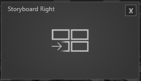

# Modules 

 

*Module* treten an verschiedenen Stellen im *Session Manager* auf. In der *Session* sind alle vorhanden, um eine *Agenda* zu füllen. Die Toolboxmodule sind entsprechend in der Toolboxkonfiguration zu finden. In Kapitel **Toolbox** wird darauf detailliert eingegangen. 

Hier ist eine Übersicht der Module aus der Session und was sie können. 
***

## Singleview Module 

Diese Module können je nach Display Setup an eine Position gezogen werden und erscheinen später im Showroom auf dem entsprechenden Display. 

Alle Singleview Module haben konsistente, allgemeine Eigenschaften, die hier aufgelistet sind. 

**Background Image:** Über den Asset Browser wird hier ein Hintergrundbild für dieses Modul geladen. 

**Size:** Hier wird die Größe der Darstellung des Fensters angegeben. Der Standardwert ist 0.75. Der Wert 1 entspricht Fullsize. 

**Title:** Titelvergabe eines Moduls. 

**Showtitle:** Durch Setzen des Hakens wird dieser Titel auch in der Show angezeigt.  

Alle folgenden Module sind Singleview Module. Ihren individuellen Eigenschaften sind zudem aufgelistet. 
***
## Browser Modul

 

•    Show Header - Der gesetzte Haken zeigt die URL-Leiste, Bookmarks etc. an. 

•    URL - Hier kann man die Start URL eintragen, mit der das Browsermodul starten soll, z.B. https://www.google.de 

•    Bookmarks 01 - 05 - Hier stehen 5 Bookmarks zur Verfügung, denen man auch URLs vergeben kann, diese werden als kleine Icons generiert und oben rechts im Browserfenster angezeigt und dienen der direkten Wahl. 

***
## HTML Modul

 

•    HTML Datei - Über den Asset Browser lässt sich eine HTML-Datei vergeben, welche in der Show angezeigt wird.  

•    Transparancy - Der gesetzte Haken schaltet den Hintergrund Transparent. 

***
## Bulletlist Modul

 

•    Title - Hier kann der Titel für die Bulletlist vergeben werden. 

•    Bullet - In einem internen Texteditor können Bulletpoints erzeugt werden. 

***

## Title Modul

 

•    Title - Über den internen Texteditor kann eine Title geschrieben werden. 

***
## Pause Modul

 

•    Titel - Über den internen Texteditor kann ein Titel vergeben werden. 

•    Bullet -  Über den internen Texteditor können Bulletpoints erzeugt werden. 

•    Timer – Im Timer wird die Länge der Pause festgelegt.  

***
## External Source 

 

•    External Source - Über das Dropdownmenü können verfügbare Quellen ausgewählt werden. 

***
## Video Player Modul

 

•    Video File - Öffnet den Asset Browser, um ein Video auszuwählen. 

•    Autostart - Ist der Haken gesetzt startet das Video automatisch. 

•    Repeat Video - Ist der Haken gesetzt läuft das Video in Schleife. 

***
## Share Price

 

•    Share Price Symbol – Durch Eingeben der WKN-Nummer eines Unternehmens wird der Share Price angezeigt. 

***
## Slide Show 

 

•    Folder Path - Öffnet den Asset Browser in dem ein Ordner, der mehrere Bilder enthält, ausgewählt werden kann. 

•    Show Navigation - Der gesetzte Haken zeigt die Navigation an 

•    Navigation Inside Frame – Ein gesetzteer Haken zeigt die Navigation im Bild an. 

***
## Multiview Module

Je nach Setup des Showrooms verhalten sich die Multiview Module anders. Das wirkt sich hauptsächlich auf die Anordnung der Fenster aus und wird angezeigt, sobald das Modul in der Session per Drag and Drop platziert wird. Zudem wird in den Eigenschaften angezeigt welche Platzierungen mit dem Showroom-Setup möglich sind. Grundsätzlich gilt: Multiview Module haben mehr als ein Fenster und halten dadurch zusätzliche Funktionen bereit. 

***
## Storyboard & Storyboard Right Module

   

Dieses Modul kann aus bis zu 3 Fenstern bestehen. Das Center Fenster zeigt Slides an, die mit einer Wischgeste nach rechts und links bewegt werden können. Ein Slide welches so bewegt wurde sammelt sich entsprechend rechts oder links in einem Fenster, und ordnet sich in einem Gitter ein. 

•    Slide Folder - Öffnet den Asset Browser, um einen Pfad zum Ordner mit den Slides auszuwählen. 

•    Storyboard Left - Je nach Setup und Platzierung ist der Haken gesetzt. Außerdem kann für dieses Fenster separat ein Background Image mit dem Asset Browser ausgewählt werden. 

•    Storyboard Right - Je nach Setup und Platzierung ist der Haken gesetzt. Außerdem kann für dieses Fenster separat ein Background Image mit dem Asset Browser ausgewählt werden. 

***
## Input Selector Modul 

 

•    Input Source 01 - 06 - Hier lassen sich verschiedene Quellen auswählen und mit einem Dashboard Layout darstellen. 

***
## Challanges Modul 

Ein Spezial Modul welches Kundenspezifisch erklärt wird. 
